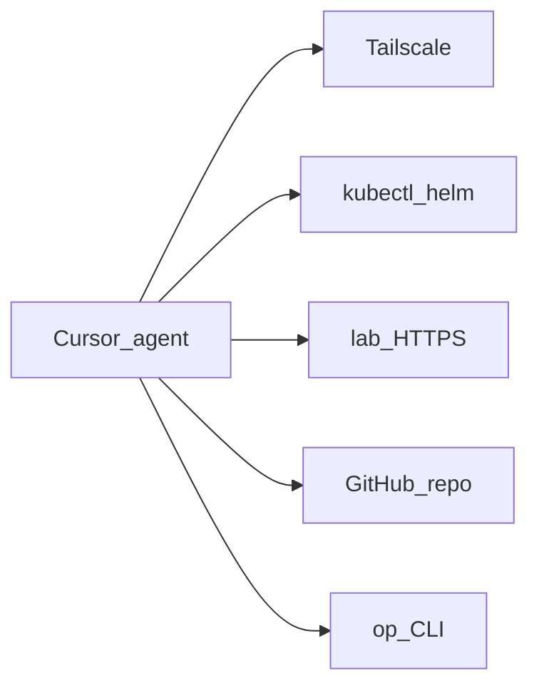

# Agent access

First-class requirement: AI agents (e.g. Cursor) can **operate and observe** the lab — not a bolt-on.

## Goal

From a Cursor session: `kubectl`, logs, Unraid/HA/Argo/Grafana APIs, and GitOps changes — without tribal SSH lore. Git remains source of truth.

## Reachability

| Path | Role |
|------|------|
| Tailscale on agent host | Primary remote path — **split DNS** for `lab.jacobdrury.com` + **subnet routes** to Homelab |
| `*.lab.jacobdrury.com` | Same URLs: LAN via Pi-hole → Cloudflare; away via split DNS → **Cloudflare direct** |
| kubeconfig / talosconfig | Local paths; CLIs via proto/moon |
| `op` | Secrets — never in Git |
| MCP (optional) | k8s / HA structured tools when shell is painful |

Details: [networking](networking.md#tailscale) (split DNS, subnet router timeline, HTTPS).

## Operating model

1. **Prefer Git** — edit this repo → PR → Argo  
2. **Break-glass shell** — diagnose / restart; avoid permanent snowflake applies  
3. **In-repo agent docs** — Cursor rules/skills: context, hostnames ([naming](naming.md)), “no secrets in Git”  
4. **Least privilege later** — optional agent Tailscale identity + limited RBAC  

## Buildout

| Phase | What |
|-------|------|
| **Now** | Tailscale IaC applied; **homelab02** interim subnet router; `http://*.lab` remote via split DNS → Cloudflare |
| **2** | **Tailscale operator** on `prd` (subnet router); Envoy + cert-manager → `https://*.lab` |
| **2** | Stable kubectl over Tailscale; Argo on `*.lab` |
| **3+** | Remove homelab02 subnet routes before pc (black) retires; retire legacy `*.homelab.com` Pi-hole records |
| **5** | Agent RBAC, optional MCP, `.cursor` rules |

**Non-goal:** public kube API or Unraid for agents. Agents use the **tailnet**.
