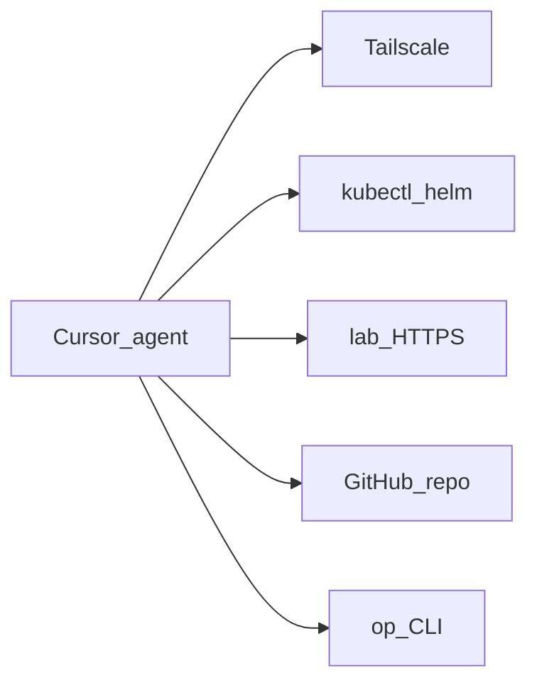

# Agent access

First-class requirement: AI agents (e.g. Cursor) can **operate and observe** the lab — not a bolt-on.

## Goal

From a Cursor session: `kubectl`, logs, Unraid/HA/Argo/Grafana APIs, and GitOps changes — without tribal SSH lore. Git remains source of truth.

## Reachability

| Path | Role |
|------|------|
| Tailscale on agent host | Primary (prefer local Cursor + Tailscale; cloud agents need Tailscale or MCP bridge) |
| kubeconfig / talosconfig | Local paths; CLIs via proto/moon |
| `*.lab.jacobdrury.com` | Same URLs as humans |
| `op` | Secrets — never in Git |
| MCP (optional) | k8s / HA structured tools when shell is painful |

## Operating model

1. **Prefer Git** — edit this repo → PR → Argo  
2. **Break-glass shell** — diagnose / restart; avoid permanent snowflake applies  
3. **In-repo agent docs** — Cursor rules/skills: context, hostnames ([naming](naming.md)), “no secrets in Git”  
4. **Least privilege later** — optional agent Tailscale identity + limited RBAC  

## Buildout

| Phase | What |
|-------|------|
| 1–2 | Tailscale on Mac + Unraid + cluster; moon tools |
| 2 | Stable kubectl over Tailscale; Argo on `*.lab` |
| 3+ | HA/Unraid API tokens in 1Password; Homepage |
| 5 | Agent RBAC, optional MCP, `.cursor` rules |

**Non-goal:** public kube API or Unraid for agents. Agents use the **tailnet**.
