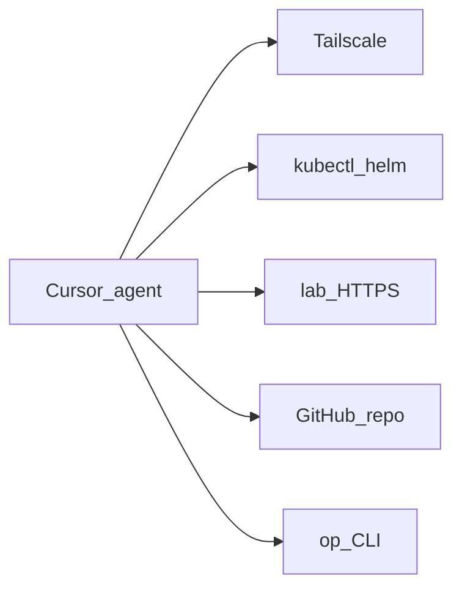

# Agent access

First-class requirement: AI agents (e.g. Cursor) can **operate and observe** the lab — not a bolt-on.

## Goal

From a Cursor session: `kubectl`, logs, Unraid/HA/Argo/Grafana APIs, and GitOps changes — without tribal SSH lore. Git remains source of truth.



## Reachability

| Path | Role |
|------|------|
| Tailscale on agent host | Primary remote path — **split DNS** for `lab.jacobdrury.com` + **subnet routes** to Homelab |
| `*.lab.jacobdrury.com` | Same URLs: LAN via Pi-hole → Cloudflare; away via split DNS → **Cloudflare direct** |
| **`connect/<cluster>/`** | In-repo kubeconfig + talosconfig — `cd connect/prd` (direnv) or `source connect/env.sh`; `moon run connect:sync` |
| `op` | Secrets — never in Git |
| MCP (optional) | k8s / HA structured tools when shell is painful |

Details: [networking](networking.md#tailscale) (split DNS, subnet router timeline, HTTPS) · [connect/README](../../connect/README.md).

## Operating model

1. **Prefer Git** — edit this repo → merge to `main` → Argo reconciles  
2. **Break-glass shell** — diagnose / restart / force-delete stuck pods; do **not** `helm upgrade` or `kubectl apply` as the steady path for anything Argo already owns  
3. **In-repo agent docs** — `AGENTS.md` / `.agents/skills`: context, hostnames ([naming](naming.md)), “no secrets in Git”  
4. **Least privilege later** — optional agent Tailscale identity + limited RBAC  

## Bootstrap scripts (`install.sh`) vs Argo

**Rule:** leave `install.sh` only for components that **must** be installed manually **before Argo exists**. Anything Argo can own entirely from Git must **never** get an install script.

| Has `install.sh` (pre-Argo chicken-and-egg) | No script — Git / Argo only |
|--------------------------------------------|-----------------------------|
| Cilium, NFS/iSCSI CSI, Connect, ESO, Argo (+ root) | cert-manager, Envoy, CNPG, Authentik, Homepage, … |

Steady state: manifests under `clusters/<env>/` with `application.yaml`; merge to `main`; Argo syncs. Scripts are not a parallel deploy path.

| Do | Don't |
|----|--------|
| Add `application.yaml` + values/resources for anything Argo can manage | Add `install.sh` because “it was handy for first install” |
| Seed 1Password items; wire `ExternalSecret`; document titles | `helm upgrade` a workload Argo already owns |
| On a fresh cluster: run the pre-Argo scripts through Argo + root, then **stop** | Keep or restore scripts for cert-manager / Envoy / apps |

**Fresh `prd` handoff:**

```text
Talos + connect/
  → install.sh only through Argo + root Application
  → Argo discovers clusters/prd/**/application.yaml from Git
  → everything else from Git only
```

Order: [platform README](../../clusters/prd/platform/README.md) · [bootstrap/README](../../bootstrap/README.md). Secrets: [secrets](secrets.md).

**Agent checklist when adding a component**

1. Would Argo already be running when this lands? → **Git only**. No `install.sh`.  
2. Needs a 1Password item? → create it + `ExternalSecret`; still no install script.  
3. Brand-new cluster with no Argo yet? → use the existing **platform** pre-Argo scripts only, then stop.

If you helm-applied something in a pinch, get it into Git and let Argo adopt it — do not leave a second install script around.

## Buildout

| Phase | What |
|-------|------|
| **Now** | Tailscale IaC; **homelab02** interim subnet router; `https://*.lab` via Envoy |
| **2 (done)** | **`connect/`**; CSI; Connect + ESO; **Argo CD**; **Envoy** + LE; Homepage; Authentik (IdP) |
| **2 (next)** | Transitional HTTPRoutes polish; **Tailscale operator**; Argo OIDC via Authentik |
| **3+** | Remove homelab02 subnet routes before pc (black) retires; retire legacy `*.homelab.com` Pi-hole records |
| **5** | Agent RBAC, optional MCP, skills |

**Non-goal:** public kube API or Unraid for agents. Agents use the **tailnet**.
