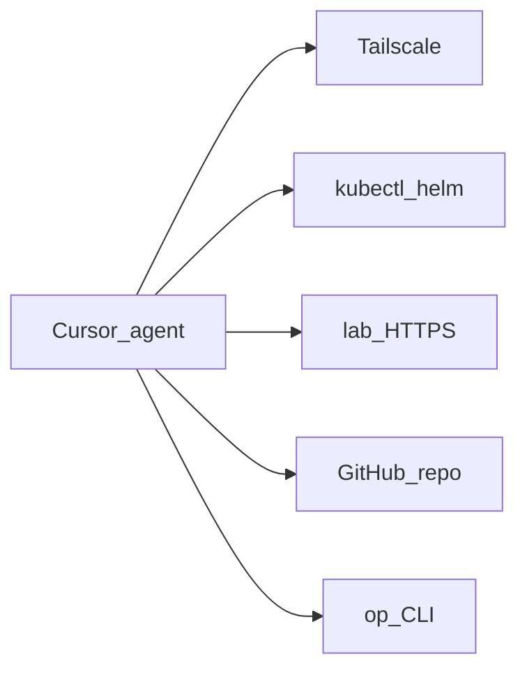

# Agent access

First-class requirement: AI agents (e.g. Cursor) can **operate and observe** the lab — not a bolt-on.

## Goal

From a Cursor session: `kubectl`, logs, Unraid/HA/Argo/Grafana APIs, and GitOps changes — without tribal SSH lore. Git remains source of truth.



## Reachability

| Path | Role |
|------|------|
| Tailscale on agent host | Primary remote path — **split DNS** for `lab.jacobdrury.com` + **subnet routes** to Homelab |
| `*.lab.jacobdrury.com` | Same URLs: LAN via Pi-hole → Cloudflare; away via split DNS → **Cloudflare direct** |
| **`connect/<cluster>/`** | In-repo kubeconfig + talosconfig — `cd connect/prd` (direnv) or `source connect/env.sh`; `moon run connect:sync` |
| `op` | Secrets — never in Git |
| MCP (optional) | k8s / HA structured tools when shell is painful |

Details: [networking](networking.md#tailscale) (split DNS, subnet router timeline, HTTPS) · [connect/README](../../connect/README.md).

## Operating model

1. **Prefer Git** — edit this repo → merge to `main` → Argo reconciles  
2. **Break-glass shell** — diagnose / restart / force-delete stuck pods; do **not** `helm upgrade` or `kubectl apply` as the steady path for anything Argo already owns  
3. **In-repo agent docs** — `AGENTS.md` / `.agents/skills`: context, hostnames ([naming](naming.md)), “no secrets in Git”  
4. **Least privilege later** — optional agent Tailscale identity + limited RBAC  

## Bootstrap scripts (`install.sh`) vs Argo

**Argo owns the cluster once it exists.** Manifests live under `clusters/<env>/` with an `application.yaml`; merge to `main` and let sync do the work.

`install.sh` is **not** a parallel install path for day-to-day or for new apps. It exists only for the **chicken-and-egg** steps on a **fresh cluster** (or total DR) **before** Argo can take over — typically seeding secrets with `op` and installing Argo itself (and whatever Argo needs underneath: CNI, Connect, ESO).

| Do | Don't |
|----|--------|
| Add `application.yaml` + values/resources in Git for new platform/apps | Add `install.sh` for Authentik, Homepage, CNPG Clusters, Envoy routes, etc. |
| Seed 1Password items agents/`op` need; document titles in README | `helm upgrade --install` a workload Argo already manages |
| Run platform bootstrap only when standing up / recovering a cluster with **no** working Argo | Treat `install.sh` as “how we deploy this normally” |
| After Argo is up: commit → push/`main` → wait for sync (or `argocd app sync`) | Leave cluster state that only exists from a local helm apply |

**Fresh `prd` handoff (mental model):**

```text
Talos + connect/
  → platform install.sh only as far as Argo + root Application
  → Argo discovers clusters/prd/**/application.yaml from Git
  → everything else (CSI if not yet in, cert-manager, Envoy, CNPG, apps…) from Git only
```

Order and which scripts are still needed for that handoff: [platform README](../../clusters/prd/platform/README.md). Secrets seeding: [secrets](secrets.md).

**Agent checklist when adding a component**

1. Can Argo sync it from Git after Connect/ESO exist? → **Git only** (`application.yaml`). No `install.sh`.  
2. Does it need a 1Password item first? → create the item; wire `ExternalSecret`; document the title — still no app `install.sh`.  
3. Is Argo (or its prerequisites) missing on a brand-new cluster? → use the **platform** bootstrap scripts, then stop.  

If you already applied something with Helm for urgency, get the same config into Git and let Argo adopt it — do not keep a second install script around.

## Buildout

| Phase | What |
|-------|------|
| **Now** | Tailscale IaC; **homelab02** interim subnet router; `https://*.lab` via Envoy |
| **2 (done)** | **`connect/`**; CSI; Connect + ESO; **Argo CD**; **Envoy** + LE; Homepage; Authentik (IdP) |
| **2 (next)** | Transitional HTTPRoutes polish; **Tailscale operator**; Argo OIDC via Authentik |
| **3+** | Remove homelab02 subnet routes before pc (black) retires; retire legacy `*.homelab.com` Pi-hole records |
| **5** | Agent RBAC, optional MCP, skills |

**Non-goal:** public kube API or Unraid for agents. Agents use the **tailnet**.
