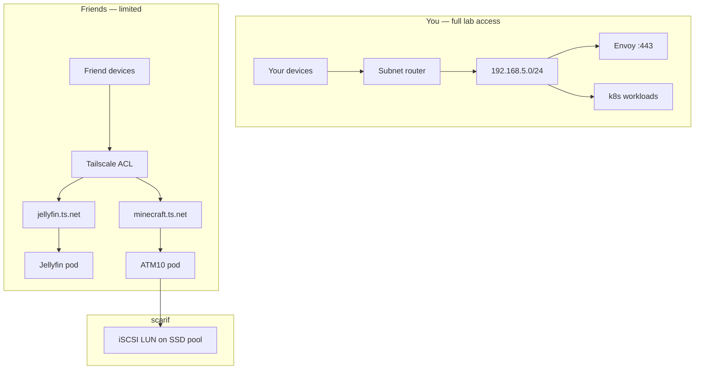

# Games — All the Mods 10 (ATM10)

Planned Minecraft server for friends on k8s. **Not in the Phase 3 migration** — deploy after core platform + media stack are stable. Track prerequisites in [roadmap](../roadmap.md#phase-6--games-atm10).

## Goals

- Host **All the Mods 10** (NeoForge, Minecraft 1.21.1, 400+ mods) on `prd`
- Friends connect over **Tailscale** using **MagicDNS** names (`*.ts.net`) — not `*.lab` URLs
- Friends can reach **Jellyfin** and **Minecraft only** — no subnet-router access to the homelab VLAN
- You keep full admin access via subnet router + `*.lab` URLs (unchanged)

## Non-goals

- Public internet exposure (no UDM port forward on `25565`)
- Friends on `jellyfin.lab.jacobdrury.com` / `minecraft.lab` — `.ts.net` is sufficient
- Sharing qBittorrent, Argo CD, Unraid, Pi-hole, or other lab services with friends
- Running ATM10 on **yavin** long-term alongside the full media stack (16 GB RAM is too tight)

---

## Requirements

| Component | ATM10 need | Notes |
|-----------|------------|--------|
| Java | **21** | NeoForge 1.21.1; Java 17 will not work |
| Server RAM | **10–12 GB** (1–5 players) | Pin heap; 12 GB comfortable for small groups |
| CPU | Strong **single-thread** | Modded MC is tick-bound; prefer modern 6c+ |
| Storage | **NVMe/SSD block** · 50–100 GB+ | World + modpack; grows with exploration |
| Network | TCP **25565** | Not HTTP — Envoy does not terminate Minecraft |

**Node placement:** pin to the **beefiest** Talos node (`nodeSelector`). Prefer **hoth** or **endor** once specs are known; avoid sharing **yavin** (i3-8100B, 16 GB) with Jellyfin + *arr* + ATM10.

---

## Architecture



| Path | Who | How |
|------|-----|-----|
| **Admin** | You | Subnet router → `192.168.5.0/24`; `https://*.lab.jacobdrury.com` via Envoy |
| **Friends — Jellyfin** | `group:friends` | Tailscale **Ingress** (L7) → `https://jellyfin.<tailnet>.ts.net` (`tag:shared`) |
| **Friends — Minecraft** | `group:friends` | Tailscale **Service** expose (L3/TCP) → `minecraft.<tailnet>.ts.net:25565` (`tag:shared`) |

**Why not subnet routes for friends?** Subnet router grants access to the whole homelab VLAN. Tailscale ACLs filter **IP + port**, not HTTP hostname — so allowing friends `yavin:443` (Envoy) would expose every app behind Envoy (Argo, qBittorrent, etc.). Per-service Tailscale expose avoids that.

---

## HTTPS on `.ts.net`

Tailscale operator exposure uses **two layers** — pick the right one per service:

| Layer | Use for | HTTPS | How |
|-------|---------|-------|-----|
| **L7** (`Ingress`, `ingressClassName: tailscale`) | Web apps (Jellyfin) | **Yes** — Let's Encrypt cert auto-provisioned for the MagicDNS FQDN | `https://jellyfin.<tailnet>.ts.net` |
| **L3** (`Service` + `tailscale.com/expose: "true"`) | TCP (Minecraft) | **No** — game protocol is raw TCP, not HTTP/TLS | `minecraft.<tailnet>.ts.net:25565` |

**L3 expose with a self-signed cert** applies only if you hit the proxy over HTTPS by mistake — Minecraft clients use plain TCP. Do **not** use L3 expose for Jellyfin; friends would get browser cert warnings.

**Prerequisites for L7 HTTPS:**

1. [HTTPS enabled for your tailnet](https://tailscale.com/kb/1153/enabling-https) (admin console → DNS — one-time)
2. Friends use the **full FQDN** (`https://jellyfin.ibex-ladon.ts.net`) — short names (`https://jellyfin`) often fail TLS because the cert is issued for the FQDN only
3. First connection may time out while Let's Encrypt provisions the cert (retry after ~1 min)

---

## Kubernetes deployment

### Layout

```text
apps/games/
  minecraft-atm10/
    namespace.yaml
    statefulset.yaml
    service.yaml          # ClusterIP + Tailscale L3 annotations
    pvc.yaml
    externalsecret.yaml   # CF API key, RCON password
apps/media/
  jellyfin/
    ingress-friends.yaml  # Tailscale L7 Ingress (friend HTTPS) — Phase 3/6
clusters/prd/
  apps-games.yaml         # Argo Application
```

### Image and modpack

Use **`itzg/minecraft-server`** with CurseForge auto-install:

| Env var | Value |
|---------|--------|
| `EULA` | `TRUE` |
| `TYPE` | `NEOFORGE` |
| `VERSION` | `1.21.1` |
| `MEMORY` | `12G` |
| `MODPACK_PLATFORM` | `AUTO_CURSEFORGE` |
| `CF_SLUG` | `all-the-mods-10` |
| `CF_API_KEY` | from ESO → 1Password |
| `VIEW_DISTANCE` | `8` (tune down if TPS drops) |
| `SIMULATION_DISTANCE` | `6` |
| `ENABLE_RCON` | `true` |
| `WHITE_LIST` | `true` (add friends by Minecraft username) |

First boot downloads 400+ mods — expect **15–20 minutes** before the port opens. Use a generous `startupProbe` (`failureThreshold: 40`, `periodSeconds: 30`).

### Resources (starting point)

```yaml
resources:
  requests:
    cpu: "4"
    memory: "12Gi"
  limits:
    cpu: "6"
    memory: "14Gi"
```

### Scheduling

```yaml
nodeSelector:
  kubernetes.io/hostname: hoth   # or endor — update when hardware is known
```

### Storage

**iSCSI block PVC** on scarif SSD pool — **not NFS**.

| Why block | Why not NFS |
|-----------|-------------|
| Single writer (one pod) | RWX not needed; higher latency for chunk I/O |
| Matches DB-style workloads in [storage](storage.md) | World corruption risk under wrong access mode |

Prerequisites: scarif **500 GB NVMe cache pool**, iSCSI target plugin, iSCSI CSI on Talos (`iscsi-tools` extension). Request **80 Gi** initially; expand LUN/PVC as the world grows.

### Minecraft — L3 Service expose (TCP)

```yaml
apiVersion: v1
kind: Service
metadata:
  name: minecraft-atm10
  annotations:
    tailscale.com/expose: "true"
    tailscale.com/hostname: "minecraft"
    tailscale.com/tags: "tag:shared"
spec:
  selector:
    app: minecraft-atm10
  ports:
    - port: 25565
      targetPort: 25565
```

Friends connect to **`minecraft.<tailnet>.ts.net:25565`**. Traffic is encrypted on the tailnet (WireGuard); there is no HTTPS layer on the game port.

### Jellyfin — L7 Ingress (HTTPS for friends)

Do **not** use `tailscale.com/expose` on the Jellyfin Service for friends — that yields a **self-signed** cert. Use a separate **Tailscale Ingress**:

```yaml
apiVersion: networking.k8s.io/v1
kind: Ingress
metadata:
  name: jellyfin-friends
  namespace: media
  annotations:
    tailscale.com/tags: "tag:shared"
spec:
  ingressClassName: tailscale
  tls:
    - hosts:
        - jellyfin          # → https://jellyfin.<tailnet>.ts.net
  defaultBackend:
    service:
      name: jellyfin
      port:
        number: 8096
```

`tailscale.com/hostname` is **ignored on Ingress** — the MagicDNS prefix comes from `spec.tls.hosts[0]` (first label only). Tags work on both Ingress and Service.

You keep `https://jellyfin.lab.jacobdrury.com` via Envoy for yourself; friends use `https://jellyfin.<tailnet>.ts.net`.

---

## Friend access — Tailscale

Documented in Git: `infrastructure/tailscale/acl.tf`. **Today:** allow-all policy — tighten before inviting friends.

### Access model

| Identity | Tailscale access |
|----------|------------------|
| **You** (`group:admin`) | `*` — subnet router, all `*.lab`, SSH to own devices |
| **Friends** (`group:friends`) | `tag:shared` only — `tcp:443`, `tcp:8096`, `tcp:25565` |
| **k8s operator** (`tag:k8s`) | Advertises subnet routes; tags exposed services `tag:shared` |

Friends **do not** need `tailscale set --accept-routes=true`.

### ACL changes (when ready)

Replace the current allow-all `grants` block with explicit rules:

```hcl
tagOwners = {
  "tag:k8s"    = ["autogroup:admin"]
  "tag:friend" = ["autogroup:admin"]
  "tag:shared" = ["tag:k8s"]
}

groups = {
  "group:admin"   = ["you@…"]           # your Tailscale identity
  "group:friends" = ["friend1@…", …]
}

grants = [
  { src = ["group:admin"],   dst = ["*"],          ip = ["*"] },
  { src = ["group:friends"], dst = ["tag:shared"], ip = ["tcp:443", "tcp:8096", "tcp:25565"] },
  { src = ["tag:k8s"],       dst = ["192.168.5.0/24"], ip = ["*"] },
]
```

Apply: `moon run tailscale:apply`.

### Inviting friends

1. Enable [HTTPS on the tailnet](https://tailscale.com/kb/1153/enabling-https) (one-time, admin console)
2. Create auth key tagged **`tag:friend`** (one-time or reusable per person)
3. Friend installs Tailscale and joins with that key
4. Share hostnames: `https://jellyfin.ibex-ladon.ts.net`, `minecraft.ibex-ladon.ts.net:25565`
5. Jellyfin: they log in with their Jellyfin account
6. Minecraft: add their Java username to the server whitelist

### MagicDNS names — what you can customize

A friend-facing URL has two parts: **`jellyfin`** `.` **`ibex-ladon.ts.net`**

| Part | Example | Customizable? | Managed how |
|------|---------|---------------|-------------|
| **Hostname prefix** | `jellyfin`, `minecraft` | **Yes** | k8s manifests in Git (Argo) — see below |
| **Tailnet suffix** | `ibex-ladon.ts.net` | **Limited** | Admin console only — **not** in OpenTofu; canonical value in [`lab.yaml`](../../infrastructure/lab.yaml) |

**Friend URLs (steady state):**

| Service | URL |
|---------|-----|
| Jellyfin | `https://jellyfin.ibex-ladon.ts.net` |
| Minecraft | `minecraft.ibex-ladon.ts.net:25565` |

**Tailnet suffix:** Renamed in [admin console → DNS](https://login.tailscale.com/admin/dns). You **cannot** choose an arbitrary name like `jacobdrury.ts.net`. Renaming again would break existing MagicDNS links and certs until clients update bookmarks.

**Hostname prefix:** Set per exposed service in k8s GitOps:

| Resource | Set hostname via |
|----------|------------------|
| `Ingress` (L7 / Jellyfin) | `spec.tls.hosts[0]` — e.g. `jellyfin` |
| `Service` (L3 / Minecraft) | `tailscale.com/hostname: "minecraft"` annotation |

**IaC split for this repo:**

| What | Tool | Path |
|------|------|------|
| ACLs, split DNS, MagicDNS on/off, auth keys | **OpenTofu** | `infrastructure/tailscale/` |
| Tailnet rename, HTTPS enable | **Admin console** | One-time manual — no Terraform resource |
| Friend service hostnames | **GitOps** (Argo) | `apps/media/jellyfin/`, `apps/games/minecraft-atm10/` |
| Your `*.lab` URLs | **OpenTofu + Envoy** | `infrastructure/dns/`, HTTPRoutes |

Tailnet suffix is also in `tofu output magic_dns_suffix` (`infrastructure/tailscale/`).

---

## Secrets (1Password → ESO)

| Secret | Use |
|--------|-----|
| CurseForge API key | `CF_API_KEY` — [developer console](https://console.curseforge.com/) |
| RCON password | Console admin (`ENABLE_RCON=true`) |
| Minecraft whitelist | Optional — or manage via RCON / server props in PVC |

Store in 1Password vault `Homelab`; sync via External Secrets Operator ([secrets](secrets.md)).

---

## Operations

| Task | Approach |
|------|----------|
| **Backups** | Snapshot iSCSI LUN or PVC; modded worlds corrupt easily — include in [Phase 1c](../roadmap.md#phase-1c--backups) plan |
| **Updates** | GitOps bump image tag or `CF_FORCE_SYNCHRONIZE`; test on copy first |
| **TPS / lag** | `/spark profiler` (bundled in ATM10); lower view/simulation distance |
| **RAM tuning** | Don't exceed ~16 GB heap — GC pauses get worse |
| **Monitoring** | Phase 5 Prometheus — alert on pod restarts, PVC usage |

---

## Phased rollout

Tied to [roadmap](../roadmap.md). Do not block core migration on this.

| Phase | ATM10-related work |
|-------|-------------------|
| **1** (done) | — |
| **1 optional** | scarif SSD pool + iSCSI target (enables block PVCs for DBs and games) |
| **2** | Tailscale **operator** on `prd`; iSCSI CSI; subnet router moves off homelab02 |
| **3** | Jellyfin on k8s — add **Tailscale L7 Ingress** (`ingress-friends.yaml`) when friend access is wanted |
| **4** | **Preferred ATM10 deploy window** — hoth/endor joined; pin server to beefiest node; confirm RAM/CPU |
| **5** | Monitoring, backup drill for game PVC |
| **6** | Deploy ATM10, tighten ACLs, invite friends — [checklist](../roadmap.md#phase-6--games-atm10) |

**Bootstrap on yavin only?** Possible for solo testing with 12 GB pinned to ATM10 and minimal other workloads — not the steady-state plan.

---

## Related

- [Networking — Tailscale](networking.md#tailscale) · [Storage — iSCSI](storage.md#iscsi--cluster)
- [Platform — repo layout](platform.md) · [Secrets](secrets.md)
- [Tailscale IaC](../../infrastructure/tailscale/README.md) · `acl.tf`
- [Roadmap Phase 6](../roadmap.md#phase-6--games-atm10)
