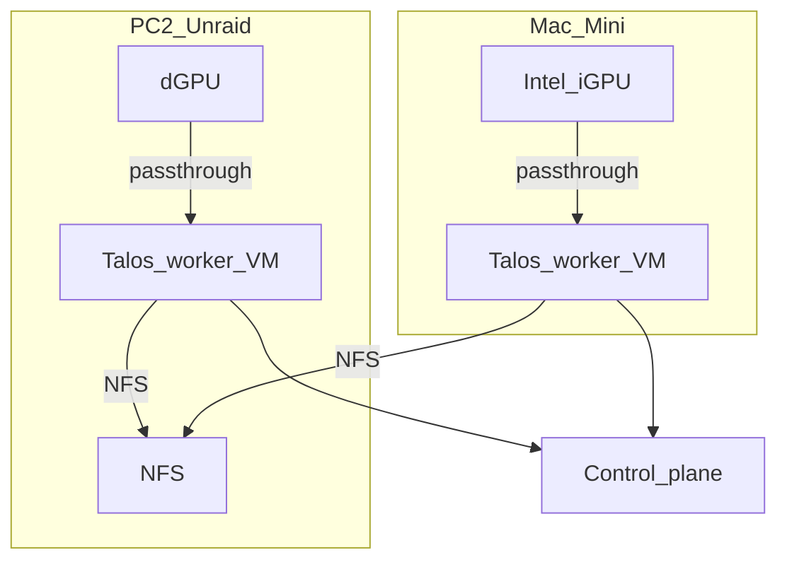

# GPU (Jellyfin)

Jellyfin stays **in-cluster**. Give it a GPU via **passthrough into one Talos worker** (not the whole cluster on Unraid).

## Sources

| Source | How | Notes |
|--------|-----|--------|
| **Mac Mini iGPU** | Proxmox passthrough → Talos worker VM | **Try first** — Quick Sync, efficient |
| **PC #2 dGPU** | Unraid VM passthrough → Talos worker | If Mini isn’t enough |
| **Quadro laptop** | Same idea if docked 24/7 | NVENC; heavier NVIDIA+Talos story |

## Talos / Jellyfin bits (Intel)

- Talos extensions: `i915` (+ intel-ucode as needed)  
- Device plugin or `/dev/dri` → Jellyfin uses `/dev/dri/renderD128`  
- Full iGPU passthrough: that VM **owns** the iGPU (fine on a headless Mini)  

## Avoid

Running the **full** Talos control plane on Unraid only to expose a GPU.
