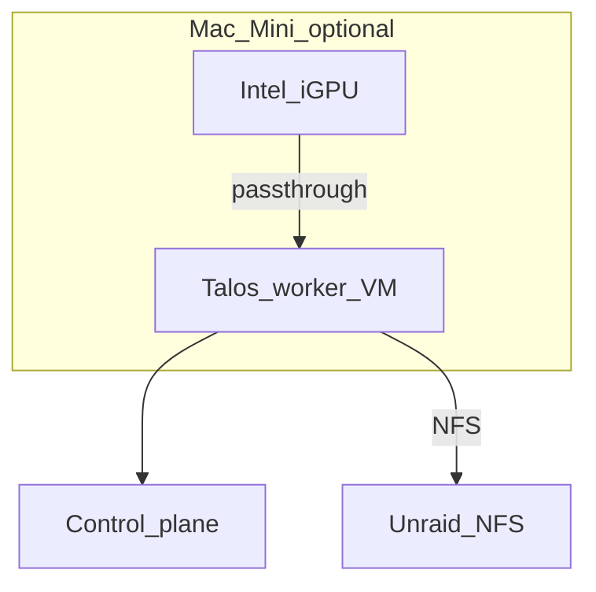

# GPU (Jellyfin)

Jellyfin stays **in-cluster**. **GPU is optional** — typical 720/1080 anime direct play needs no hardware encode. Add a GPU later only if clients start forcing transcodes.

If needed: pass a GPU into **one Talos worker** (not the whole cluster on Unraid).

## Sources (when you care)

| Source | How | Notes |
|--------|-----|--------|
| **Mac Mini iGPU** | Talos worker/CP with `i915` (BM) or Proxmox passthrough (interim VM) | Quick Sync (QSV); only if transcodes appear |
| **pc (white) dGPU** | — | **Removed / unused** for Unraid power; GTX 780 not worth it |
| **Quadro laptop** | Docked 24/7 | NVENC; only if Mini isn’t enough |

## Talos / Jellyfin bits (Intel)

- Talos extensions: `i915` (+ intel-ucode as needed)  
- Device plugin or `/dev/dri` → Jellyfin uses `/dev/dri/renderD128`  
- Full iGPU passthrough: that VM **owns** the iGPU (fine on a headless Mini)  

## Avoid

Running the **full** Talos control plane on Unraid only to expose a GPU.
