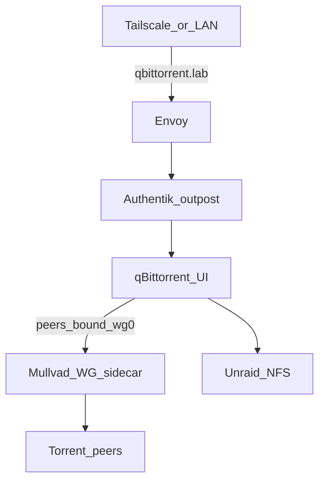

# Media stack (*arr + qBittorrent + Jellyfin)

**Live on Talos `prd`** under [`clusters/prd/apps/media/`](../../clusters/prd/apps/media/) — configs copied from the Proxmox arr VM (not fresh installs). **arr VM 101 is stopped** (`onboot=0`); `arr.lab` / `arr.homelab.com` DNS retired.

| App | Auth | Data |
|-----|------|------|
| qBittorrent, Sonarr ×2, Prowlarr | **Authentik Proxy** ([Sonarr guide](https://integrations.goauthentik.io/media/sonarr/)) | Shared CNPG **`media-pg`**; NFS libraries/downloads |
| Jellyfin (`10.11.11`) | Envoy → Service (native Jellyfin accounts) | SQLite on iSCSI config PVC; NFS `/anime` + `/tv` (read-only). GPU notes: [gpu](gpu.md) |

## Runtime shape

| Piece | Where |
|-------|--------|
| Pods | namespace `media` — qBit + Mullvad WG sidecar, Sonarr anime/TV, Prowlarr, Jellyfin, `media-pg` |
| Libraries / downloads | Scarif NFS static PVs (`media/{anime,tv,downloads}`); *arr `PUID=99` / `PGID=100`; Jellyfin mounts libraries read-only as UID 1000 |
| Config | iSCSI PVCs (copied from arr); Jellyfin also uses `emptyDir` for `/cache` |
| Browser URLs (*arr / qBit) | Envoy → **Authentik embedded outpost** → Services ([`resources-media-routes.yaml`](../../clusters/prd/apps/authentik/resources-media-routes.yaml)) |
| Browser URL (Jellyfin) | Envoy → `jellyfin.media` Service `:8096` |
| API / Homepage | Authentik `skip_path_regex` on `/api` (and `/feed` for Sonarr) — widgets use API keys; Jellyfin widget hits Jellyfin API directly |
| Native UI auth | `AuthenticationMethod=External` (*arr); qBit `AuthSubnetWhitelist` for cluster CIDRs; Jellyfin native accounts |

## NFS UID (scarif + writers)

Unraid NFS squashes to `nobody:users` (`99:100`); every writer must match. Details: [storage — NFS permissions](storage.md#nfs-permissions-uid--squash).

```bash
chown -R nobody:users /mnt/disks/ZXA0VZBA/media
chmod -R ug+rwX,o+rX /mnt/disks/ZXA0VZBA/media
```

k8s Deployments use **`PUID=99` / `PGID=100`** (`fsGroup: 100`). Static NFS PVs mount the existing tree (not dynamic `scarif-nfs` subdirs).

## Config + wiring

Configs live on iSCSI PVCs (originally copied from the arr VM). Live wiring:

1. qBit → Network interface **`wg0`**; WebUI port **8080**
2. Sonarr download client → `qbittorrent.media.svc.cluster.local:8080`
3. Prowlarr apps → `sonarr-anime` / `sonarr-tv` in-cluster Services
4. Sonarr **indexers** → `http://prowlarr.media.svc.cluster.local:9696/…`
5. *arr mounts keep Compose paths: `/home/data/{anime,tv,downloads}`
6. Jellyfin mounts: `/anime`, `/tv`, `/config` (Compose paths preserved)

### Postgres (*arr)

Shared CNPG Cluster **`media-pg`** in namespace `media` (iSCSI). 1Password **`prd Media Postgres`**.

| App | Main DB | Log DB |
|-----|---------|--------|
| Sonarr anime | `sonarr_anime_main` | `sonarr_anime_log` |
| Sonarr TV | `sonarr_tv_main` | `sonarr_tv_log` |
| Prowlarr | `prowlarr_main` | `prowlarr_log` |

Init containers upsert `Postgres*` + `AuthenticationMethod=External`. qBittorrent stays on disk (no Postgres).

## qBittorrent + VPN

| Traffic | Requirement |
|---------|-------------|
| BitTorrent peers (up/down) | Out **Mullvad WireGuard** (sidecar `wg0`; qBit binds to it) |
| Web UI | **`https://qbittorrent.lab.jacobdrury.com`** — Authentik Proxy → qBit Service |

Mullvad conf in 1Password **`prd Mullvad WireGuard`**. Sidecar runs `wg-quick` with **`Table = off`** so UI/DNS stay on eth0. **Gluetun is not used on k8s.**



## Monitoring

Uptime Kuma probes Authentik **skip paths** that reach the app (`/api` → 401 for *arr; qBit `/api/v2/app/version` → 200), not the unauthenticated `/` redirect to Authentik. Jellyfin monitor hits `/` (native auth, no Authentik). See [`infrastructure/uptime-kuma/monitors.tf`](../../infrastructure/uptime-kuma/monitors.tf).
