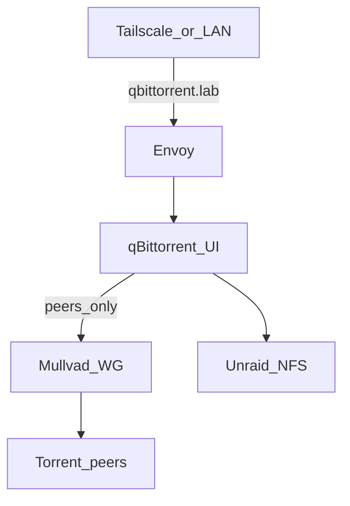

# Media stack (*arr + qBittorrent)

Jellyfin, Sonarr ×2, Prowlarr, qBittorrent on k8s; libraries/downloads on Unraid NFS. Jellyfin GPU: [gpu](gpu.md).

## qBittorrent + VPN

| Traffic | Requirement |
|---------|-------------|
| BitTorrent peers (up/down) | Out **Mullvad WireGuard** (kill switch / no clearnet leak) |
| Web UI | **`https://qbittorrent.lab.jacobdrury.com`** — Envoy TLS; same URL on LAN and Tailscale ([networking](networking.md#https)) |

No special UI exposure story — Envoy + `*.lab.jacobdrury.com` like Argo/Jellyfin/Homepage. Implementation detail at deploy time (Service + HTTPRoute, etc.) does not matter as long as that hostname works on the lab path.

**Implication for the Pod:** peer traffic must use the VPN iface; the Web UI port must stay reachable from Envoy on the cluster network (so the UI is not forced through Mullvad). Common approaches: qBittorrent **bind peers to `wg0`**, or Gluetun/similar with lab/cluster CIDRs allowed to the UI port. Sidecar/image choice is TBD in Phase 3; Mullvad stays the provider. Secrets in 1Password.

Sonarr/Prowlarr stay off-VPN and call the qBit API in-cluster (or via the same hostname if you prefer).

