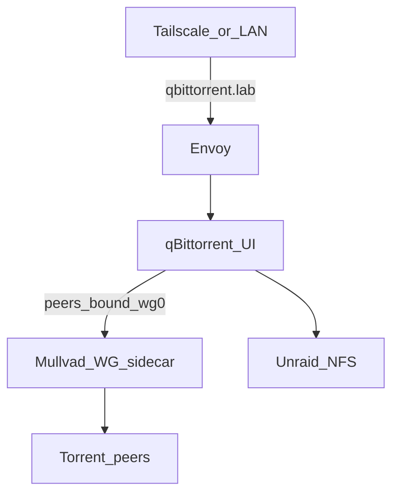

# Media stack (*arr + qBittorrent)

Jellyfin, Sonarr ×2, Prowlarr, qBittorrent on k8s; libraries/downloads on Unraid NFS. Jellyfin GPU: [gpu](gpu.md).

**Phase 3 (in progress):** download stack GitOps under [`clusters/prd/apps/media/`](../../clusters/prd/apps/media/) — **config copied from Proxmox arr VM** (not a fresh install). Jellyfin remains transitional → arr until a later cutover. *arr apps use shared **CNPG `media-pg`** (Postgres), not SQLite.

## NFS UID fix (VM 101 `arr` + k8s)

**Status:** required before/with Phase 3 cutover — downloads/libraries must be writable as `99:100`.

Root cause and Unraid/k8s rules: [storage — NFS permissions](storage.md#nfs-permissions-uid--squash). Summary: Unraid NFS squashes to `nobody:users` (`99:100`); apps must match.

### On scarif

```bash
chown -R nobody:users /mnt/disks/ZXA0VZBA/media
chmod -R ug+rwX,o+rX /mnt/disks/ZXA0VZBA/media
ls -ld /mnt/disks/ZXA0VZBA/media /mnt/disks/ZXA0VZBA/media/downloads
```

### On arr (Compose) — until cutover

1. In `/home/arr/docker/docker-compose.yml`, set for every service that mounts `/mnt/data` (at least `qbittorrent`, `sonarr-anime`, `sonarr-tv`; also Bazarr / Jellyfin if they write media):

   ```yaml
   - PUID=99
   - PGID=100
   ```

2. Recreate those services:

   ```bash
   cd /home/arr/docker
   docker compose up -d qbittorrent sonarr-anime sonarr-tv   # + others if changed
   ```

3. Verify:

   ```bash
   docker exec qbittorrent id    # expect uid=99 gid=100
   touch /mnt/data/media/downloads/.write-test && rm /mnt/data/media/downloads/.write-test
   docker exec -u abc qbittorrent touch /home/data/downloads/.write-test \
     && docker exec -u abc qbittorrent rm /home/data/downloads/.write-test
   ```

### k8s (Phase 3)

Media Deployments use **`PUID=99` / `PGID=100`** (`fsGroup: 100`). Static NFS PVs mount the existing `media/{anime,tv,downloads}` tree (not dynamic `scarif-nfs` subdirs).

## Config migration from Proxmox arr

| App | Source on arr | k8s PVC |
|-----|---------------|---------|
| qBittorrent | `/home/arr/docker/arr-stack/qbittorrent/` | `qbittorrent-config` |
| Sonarr anime | `…/sonarr-anime/` | `sonarr-anime-config` |
| Sonarr TV | `…/sonarr-tv/` | `sonarr-tv-config` |
| Prowlarr | `…/prowlarr/` | `prowlarr-config` |

Procedure: [`copy-configs-from-arr.sh`](../../clusters/prd/apps/media/scripts/copy-configs-from-arr.sh) — stops Compose for those four → tar → PVC → `chown 99:100` → rollout restart. **Jellyfin stays up.**

After copy:

1. qBit → Network interface **`wg0`**; WebUI port **8080**
2. Sonarr download client → `qbittorrent.media.svc.cluster.local:8080`
3. Prowlarr apps → `sonarr-anime` / `sonarr-tv` in-cluster Services
4. Sonarr **indexers** (Torznab) → `http://prowlarr.media.svc.cluster.local:9696/…` (was `localhost:9696` under Gluetun)
5. Media mounts keep Compose paths: `/home/data/anime`, `/home/data/tv`, `/home/data/downloads`

## Postgres (*arr)

Shared CNPG Cluster **`media-pg`** in namespace `media` (iSCSI). 1Password **`prd Media Postgres`**.

| App | Main DB | Log DB |
|-----|---------|--------|
| Sonarr anime | `sonarr_anime_main` | `sonarr_anime_log` |
| Sonarr TV | `sonarr_tv_main` | `sonarr_tv_log` |
| Prowlarr | `prowlarr_main` | `prowlarr_log` |

Init containers upsert `Postgres*` into each app’s `config.xml`. SQLite → Postgres one-shot: [`migrate-arr-to-postgres.sh`](../../clusters/prd/apps/media/scripts/migrate-arr-to-postgres.sh). qBittorrent stays on disk (no Postgres). Backups of these DBs are **not** done by Servarr — rely on CNPG / volume snapshots later.

## qBittorrent + VPN

| Traffic | Requirement |
|---------|-------------|
| BitTorrent peers (up/down) | Out **Mullvad WireGuard** (sidecar `wg0`; qBit binds to it) |
| Web UI | **`https://qbittorrent.lab.jacobdrury.com`** — Envoy TLS; same URL on LAN and Tailscale ([networking](networking.md#https)) |

**k8s pattern:** Mullvad conf in 1Password **`prd Mullvad WireGuard`** (password field = full `wg0.conf`). Sidecar runs `wg-quick` with **`Table = off`** so the pod default route (UI/DNS stay on eth0). Peers use `wg0` via qBit interface binding. **Gluetun is not used on k8s.**

**SSO:** public `*.lab` UIs for qBit / Sonarr / Prowlarr use **Authentik Proxy** (same pattern as Uptime Kuma). In-cluster clients (Sonarr→Prowlarr, Homepage API via `/api` skip) do not need a browser session.

Sonarr/Prowlarr stay off-VPN and call the qBit API in-cluster.


