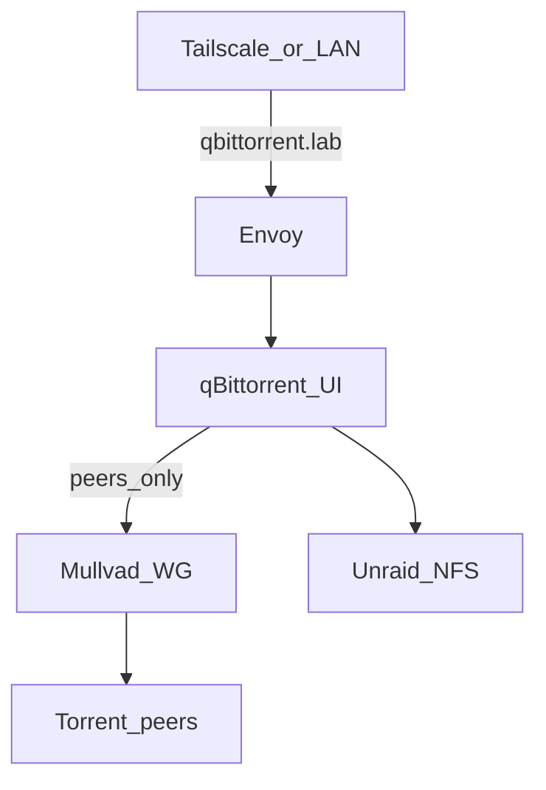

# Media stack (*arr + qBittorrent)

Jellyfin, Sonarr ×2, Prowlarr, qBittorrent on k8s; libraries/downloads on Unraid NFS. Jellyfin GPU: [gpu](gpu.md).

## NFS UID fix (VM 101 `arr`)

**Status:** deferred — downloads/libraries temporarily world-writable after Sep 2026 incident; apply when convenient.

Root cause and Unraid/k8s rules: [storage — NFS permissions](storage.md#nfs-permissions-uid--squash). Summary: Unraid NFS squashes to `nobody:users` (`99:100`); apps must match.

### On scarif

```bash
chown -R nobody:users /mnt/disks/ZXA0VZBA/media
chmod -R ug+rwX,o+rX /mnt/disks/ZXA0VZBA/media
ls -ld /mnt/disks/ZXA0VZBA/media /mnt/disks/ZXA0VZBA/media/downloads
```

### On arr (Compose)

1. In `/home/arr/docker/docker-compose.yml`, set for every service that mounts `/mnt/data` (at least `qbittorrent`, `sonarr-anime`, `sonarr-tv`; also Bazarr / Jellyfin if they write media):

   ```yaml
   - PUID=99
   - PGID=100
   ```

2. Recreate those services:

   ```bash
   cd /home/arr/docker
   docker compose up -d qbittorrent sonarr-anime sonarr-tv   # + others if changed
   ```

3. Verify:

   ```bash
   docker exec qbittorrent id    # expect uid=99 gid=100
   touch /mnt/data/media/downloads/.write-test && rm /mnt/data/media/downloads/.write-test
   docker exec -u abc qbittorrent touch /home/data/downloads/.write-test \
     && docker exec -u abc qbittorrent rm /home/data/downloads/.write-test
   ```

### k8s (Phase 3)

Same requirement — not Compose-only. Media charts/manifests should use **`runAsUser: 99`**, **`runAsGroup` / `fsGroup: 100`** (or chart `PUID`/`PGID` equivalents). Do this once on scarif ownership; then Docker cutover and later NFS CSI Pods both work without `777`.

## qBittorrent + VPN

| Traffic | Requirement |
|---------|-------------|
| BitTorrent peers (up/down) | Out **Mullvad WireGuard** (kill switch / no clearnet leak) |
| Web UI | **`https://qbittorrent.lab.jacobdrury.com`** — Envoy TLS; same URL on LAN and Tailscale ([networking](networking.md#https)) |

No special UI exposure story — Envoy + `*.lab.jacobdrury.com` like Argo/Jellyfin/Homepage. Implementation detail at deploy time (Service + HTTPRoute, etc.) does not matter as long as that hostname works on the lab path.

**Implication for the Pod:** peer traffic must use the VPN iface; the Web UI port must stay reachable from Envoy on the cluster network (so the UI is not forced through Mullvad). Common approaches: qBittorrent **bind peers to `wg0`**, or Gluetun/similar with lab/cluster CIDRs allowed to the UI port. Sidecar/image choice is TBD in Phase 3; Mullvad stays the provider. Secrets in 1Password.

Sonarr/Prowlarr stay off-VPN and call the qBit API in-cluster (or via the same hostname if you prefer).


