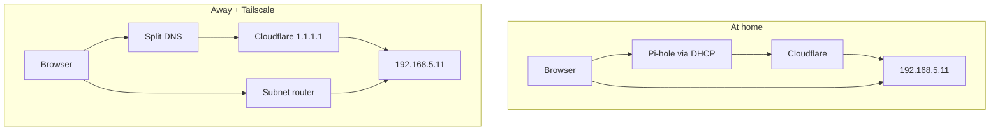
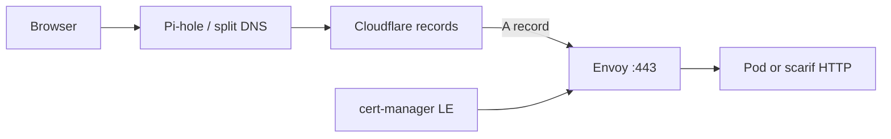

# Networking

Homelab VLAN (UniFi), DNS/TLS (`lab.jacobdrury.com`), and Tailscale. Leans: [decisions](../decisions.md).

## UniFi (homelab VLAN)

Dedicated **homelab VLAN**, isolated from trusted LAN / IoT, with **selective** allow rules (e.g. admin → lab; deny lab → sensitive VLANs by default).

**Gate before Talos:** lab hosts (scarif, yavin, future CPs) move off flat `192.168.1.0/24` onto this VLAN first. Manage with **OpenTofu** (`infrastructure/unifi/`) — not UI-only.

### Addressing (VLAN 5 — homelab)

| Resource | IP | Notes |
|----------|-----|--------|
| Subnet | `192.168.5.0/24` | UniFi network **`Homelab`** (VLAN 5) |
| DHCP pool | `.6–.254` | Same convention as Drury / IoT / Guest / Camera |
| **scarif** | `.10` static | NFS/iSCSI — static on host + reservation |
| **yavin** | `.11` static | Talos CP #1 |
| **hoth** | `.12` static | Talos CP #2 (Phase 4) |
| **endor** | `.13` static | Talos CP #3 (Phase 4) |
| API / VIP | `.20` reserved | Optional future VIP; DNS may point here at 3 CPs |
| `k8s.lab.jacobdrury.com` | → `.11` (now) | Kubernetes API endpoint — [decisions](../decisions.md) |

### Unraid IP

| Approach | Verdict |
|----------|---------|
| **Static on Unraid** outside DHCP pool (e.g. `.10`) | **Preferred** — stable for NFS if controller is down |
| UniFi fixed IP / reservation only | Weaker at Unraid boot |
| Both | Optional niceness |

Example scheme (pick numbers that fit your UniFi site): see table above. **scarif** retired `192.168.1.10` (Aug 2026); update [inventory](../inventory.md) when other hosts move.

### UniFi IaC

OpenTofu under `infrastructure/unifi/` (API key in 1Password). Community providers can manage networks and firewall (legacy rules vs zone policies depend on UniFi Network version — pin the provider).

- **Required before Phase 2:** homelab VLAN/network + DHCP range + baseline firewall  
- **Drury (VLAN 1) → Homelab:** allow all (Phase 1.5; tighten later)  
- Deny **Homelab → IoT / Guest / Camera** by default  
- Codify static reservations for scarif, yavin, and `k8s.lab` target  
- Don’t IaC every Wi‑Fi tweak on day one  

## Domain & DNS

| | |
|--|--|
| Base zone | `lab.jacobdrury.com` (under `jacobdrury.com`) |
| Registrar today | Squarespace |
| DNS for automation | **Cloudflare** (Squarespace has no usable DNS API for LE) |
| Later | Transfer registration → Cloudflare Registrar |

**Preserve on cutover:** GitHub Pages for apex `jacobdrury.com` (`www` + A records; **DNS-only** / grey cloud).

### IaC (Cloudflare)

**OpenTofu from day one** — not a later catch-up. Phase 1.5 exit requires DNS in Git.

| Layer | Tool | Owns |
|-------|------|------|
| Static records | OpenTofu → `infrastructure/dns/` | Pages apex/`www`, `lab` zone, **`k8s.lab.jacobdrury.com`** |
| App hostnames (optional) | external-dns | From HTTPRoutes |
| ACME TXT | cert-manager | Ephemeral — not in Tofu |

### Infra DNS (`*.lab.jacobdrury.com`)

**Phase 1.5** — OpenTofu creates **DNS-only** (grey cloud) A records in Cloudflare. Use these instead of raw IPs on the homelab VLAN.

| FQDN | Points to | Role |
|------|-----------|------|
| `scarif.lab.jacobdrury.com` | `192.168.5.10` | NAS / NFS |
| `yavin.lab.jacobdrury.com` | `192.168.5.11` | Talos CP #1 |
| `k8s.lab.jacobdrury.com` | `192.168.5.11` | Kubernetes API (same node until VIP) |
| `hoth.lab.jacobdrury.com` | `192.168.5.12` | Talos CP #2 (Phase 4) |
| `endor.lab.jacobdrury.com` | `192.168.5.13` | Talos CP #3 (Phase 4) |

**Apps (Phase 2–3):** `jellyfin.lab`, `qbittorrent.lab`, `argocd.lab`, etc. — A records → **Envoy** on yavin (`.11` or VIP `.20`); created by **external-dns** from HTTPRoutes (or OpenTofu until external-dns is live).

**Resolving names on LAN**

Pi-hole forwards `lab.jacobdrury.com` to Cloudflare (`1.1.1.1` / `1.0.0.1`) via `infrastructure/pihole/dns_forward.tf`. Infra and app records live in `infrastructure/dns/` (+ external-dns later). Answers are **RFC1918** (grey cloud only — never proxied).

**Legacy `*.homelab.com`** — local A records in `local_dns.auto.tfvars` only until apps move to k8s and retire those names; not part of the long-term `*.lab` model.

When Pi-hole moves to k8s (Phase 3, last), LAN clients point at the cluster instance; **`*.lab` stays in Cloudflare** — no Tailscale split DNS change (see below).

### Same URLs at home and away

Cloudflare is the **single source of truth** for what IP a `*.lab` name resolves to. At home and away the **answer is the same** (e.g. `jellyfin.lab` → `192.168.5.11`). Away from home you also need **routing** to that private IP.

| Piece | Role |
|-------|------|
| **Cloudflare** | Authoritative `*.lab` records (OpenTofu + external-dns) |
| **Pi-hole (LAN only)** | DHCP DNS + ad blocking; forwards `*.lab` → Cloudflare |
| **Tailscale split DNS** | Off-LAN: send `lab.jacobdrury.com` → **Cloudflare** (`1.1.1.1` / `1.0.0.1`) — not via Pi-hole |
| **Subnet router** | Advertise `192.168.5.0/24` so tailnet clients can reach Homelab RFC1918 addresses |

**Why not Pi-hole on Tailscale?** Same Cloudflare answers either way; direct split DNS drops a tailnet hop and avoids depending on pc (black) / Pi-hole LXC for remote lab DNS. Pi-hole is for **LAN ad blocking**, not required on the tailnet path. Legacy `*.homelab.com` names retire with the k8s migration — not a reason to route tailnet DNS through Pi-hole.



**Do not** use Cloudflare orange cloud or public A records for lab apps — private IPs stay DNS-only.

### Kubernetes API

| Record | Purpose |
|--------|---------|
| **`k8s.lab.jacobdrury.com`** | Talos / kubeconfig API endpoint — stable name from first bootstrap |

Single-node: Tofu A record → **yavin** on homelab VLAN. At 3 CPs: same name → VIP or updated target (no kubeconfig hostname change).

### Environments → hostnames

| Env | When | Hostnames |
|-----|------|-----------|
| **prd** | Now | `*.lab.jacobdrury.com` (no `prd` in name) |
| **stg** | Later | `*.stg.lab.jacobdrury.com` |

## HTTPS

**Envoy Gateway** on the Homelab VLAN terminates TLS for k8s apps and selected backends. **cert-manager + Let’s Encrypt DNS-01** via Cloudflare (API token in 1Password) — no public HTTP ingress required.

### Certificates

| Scope | How |
|-------|-----|
| **k8s apps** (`jellyfin.lab`, `argocd.lab`, …) | cert-manager Certificate on Gateway or wildcard **`*.lab.jacobdrury.com`** |
| **ACME** | DNS-01 TXT in Cloudflare (ephemeral; not in OpenTofu) |
| **scarif** (Unraid) | **Envoy reverse-proxy** → `http://192.168.5.10:80` — LE cert on Envoy; Unraid stays HTTP internally. **Today (pre-cluster):** use `http://scarif.lab` over Tailscale; **Phase 2:** same hostname → `https://` (DNS unchanged) |
| **Not used** | Cloudflare proxy (orange cloud), Cloudflare Tunnel, Tailscale certs for `*.lab` names |

### Access (LAN and Tailscale)

Same hostname and certificate in both places — e.g. **`https://jellyfin.lab.jacobdrury.com`**:

1. DNS → Pi-hole (LAN) or Cloudflare (Tailscale split DNS) → same RFC1918 A record
2. **LAN:** direct route to Envoy `:443`
3. **Away:** split DNS → Cloudflare (same answer) + subnet router → Envoy `:443`
4. Envoy → HTTPRoute → pod (or HTTP backend for scarif)



- **LAN (Phase 2–3):** Pi-hole on pc (black) at `.11` until k8s cutover (**last** in Phase 3)
- **LAN (steady):** cluster Pi-hole on Homelab VLAN
- **Remote:** Tailscale split DNS → **Cloudflare** + subnet router — **same URLs**, not `*.ts.net`
- **Not** public by default; add Cloudflare Tunnel / Funnel only if needed later

## Tailscale

Remote access to **`*.lab.jacobdrury.com`** uses **split DNS + subnet router** (standard homelab pattern for RFC1918 names in public DNS). MagicDNS `*.ts.net` names are optional; they are **not** the primary app URLs.

### Components

| Piece | Role | When |
|-------|------|------|
| **Agent Mac** | Tailscale client; split DNS + accept routes | **Now** |
| **homelab02** | **Interim** subnet router (`192.168.1.0/24`, `192.168.5.0/24`) if remote `*.lab` needed before cluster | Until Phase 2; **remove routes when pc (black) leaves lab** |
| **K8s operator** | **Steady-state** subnet router — advertise **`192.168.5.0/24`**; optional extra tailnet exposure for API/HTTPRoutes | Phase 2+ |
| **scarif** | Optional Tailscale client (Unraid plugin) — not required if Envoy + subnet router cover admin | Phase 2+ optional |
| **Exit node** | **Not** on lab hosts — homelab02 exit node **disabled** (Aug 2026) |

### Split DNS (Tailscale admin)

Configure in Git — `infrastructure/tailscale/` (`moon run tailscale:apply`). Or once in [login.tailscale.com/admin/dns](https://login.tailscale.com/admin/dns) if importing:

| Setting | Value |
|---------|--------|
| **Split DNS domain** | `lab.jacobdrury.com` |
| **Nameserver** | **Cloudflare** — `1.1.1.1` or `1.0.0.1` (resolves authoritative zone; same RFC1918 answers as LAN) |

Optional: route all tailnet DNS through Pi-hole only if you want **ad blocking away from home** — not required for `*.lab`.

Clients must **accept subnet routes** (Tailscale app → use subnets / `tailscale set --accept-routes=true`).

### Subnet router timeline

| Phase | Subnet router | Routes |
|-------|---------------|--------|
| **Interim** | **homelab02** (pc black) | `192.168.1.0/24`, `192.168.5.0/24` — approve in admin; disable before gaming PC retires |
| **Steady (Phase 2+)** | **Tailscale operator** on `prd` | **`192.168.5.0/24`** — Homelab only; drop `.1/24` after Pi-hole and apps leave Drury VLAN |
| **Retired** | homelab02 | No lab routes — personal Tailscale optional |

```bash
# Interim only (homelab02) — remove after cluster operator is live
tailscale set --advertise-routes=192.168.1.0/24,192.168.5.0/24
```

Operator config (Phase 2) replaces homelab02 advertise/enable; document in `apps/system/tailscale/`. Tailnet DNS stays in `infrastructure/tailscale/`.

Free Personal plan is enough until limits hit. Agents: [agents](agents.md).
