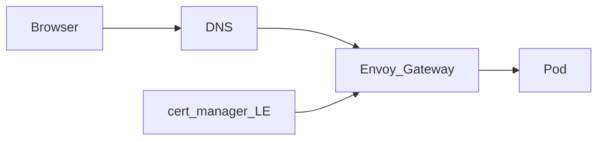

# Networking

Homelab VLAN (UniFi), DNS/TLS (`lab.jacobdrury.com`), and Tailscale. Leans: [decisions](../decisions.md).

## UniFi (homelab VLAN)

Dedicated **homelab VLAN**, isolated from trusted LAN / IoT, with **selective** allow rules (e.g. admin → lab; deny lab → sensitive VLANs by default).

**Gate before Talos:** lab hosts (scarif, yavin, future CPs) move off flat `192.168.1.0/24` onto this VLAN first. Manage with **OpenTofu** (`infrastructure/unifi/`) — not UI-only.

### Addressing (VLAN 5 — homelab)

| Resource | IP | Notes |
|----------|-----|--------|
| Subnet | `192.168.5.0/24` | UniFi network **`Homelab`** (VLAN 5) |
| DHCP pool | `.6–.254` | Same convention as Drury / IoT / Guest / Camera |
| **scarif** | `.10` static | NFS/iSCSI — static on host + reservation |
| **yavin** | `.11` static | Talos CP #1 |
| **hoth** | `.12` static | Talos CP #2 (Phase 4) |
| **endor** | `.13` static | Talos CP #3 (Phase 4) |
| API / VIP | `.20` reserved | Optional future VIP; DNS may point here at 3 CPs |
| `k8s.lab.jacobdrury.com` | → `.11` (now) | Kubernetes API endpoint — [decisions](../decisions.md) |

### Unraid IP

| Approach | Verdict |
|----------|---------|
| **Static on Unraid** outside DHCP pool (e.g. `.10`) | **Preferred** — stable for NFS if controller is down |
| UniFi fixed IP / reservation only | Weaker at Unraid boot |
| Both | Optional niceness |

Example scheme (pick numbers that fit your UniFi site): see table above. After migration, retire flat-LAN addresses in [inventory](../inventory.md).

### UniFi IaC

OpenTofu under `infrastructure/unifi/` (API key in 1Password). Community providers can manage networks and firewall (legacy rules vs zone policies depend on UniFi Network version — pin the provider).

- **Required before Phase 2:** homelab VLAN/network + DHCP range + baseline firewall  
- **Drury (VLAN 1) → Homelab:** allow all (Phase 1.5; tighten later)  
- Deny **Homelab → IoT / Guest / Camera** by default  
- Codify static reservations for scarif, yavin, and `k8s.lab` target  
- Don’t IaC every Wi‑Fi tweak on day one  

## Domain & DNS

| | |
|--|--|
| Base zone | `lab.jacobdrury.com` (under `jacobdrury.com`) |
| Registrar today | Squarespace |
| DNS for automation | **Cloudflare** (Squarespace has no usable DNS API for LE) |
| Later | Transfer registration → Cloudflare Registrar |

**Preserve on cutover:** GitHub Pages for apex `jacobdrury.com` (`www` + A records; **DNS-only** / grey cloud).

### IaC (Cloudflare)

**OpenTofu from day one** — not a later catch-up. Phase 1.5 exit requires DNS in Git.

| Layer | Tool | Owns |
|-------|------|------|
| Static records | OpenTofu → `infrastructure/dns/` | Pages apex/`www`, `lab` zone, **`k8s.lab.jacobdrury.com`** |
| App hostnames (optional) | external-dns | From HTTPRoutes |
| ACME TXT | cert-manager | Ephemeral — not in Tofu |

### Infra DNS (`*.lab.jacobdrury.com`)

**Phase 1.5** — OpenTofu creates **DNS-only** (grey cloud) A records in Cloudflare. Use these instead of raw IPs on the homelab VLAN.

| FQDN | Points to | Role |
|------|-----------|------|
| `scarif.lab.jacobdrury.com` | `192.168.5.10` | NAS / NFS |
| `yavin.lab.jacobdrury.com` | `192.168.5.11` | Talos CP #1 |
| `k8s.lab.jacobdrury.com` | `192.168.5.11` | Kubernetes API (same node until VIP) |
| `hoth.lab.jacobdrury.com` | `192.168.5.12` | Talos CP #2 (Phase 4) |
| `endor.lab.jacobdrury.com` | `192.168.5.13` | Talos CP #3 (Phase 4) |

**Apps (Phase 2–3):** `jellyfin.lab`, `qbittorrent.lab`, `argocd.lab`, etc. — same pattern; Envoy + cert-manager later.

**Resolving names on LAN**

Pi-hole forwards `lab.jacobdrury.com` to Cloudflare (`1.1.1.1` / `1.0.0.1`) via `infrastructure/pihole/dns_forward.tf`. Infra and app records live only in `infrastructure/dns/` (+ external-dns later). When Pi-hole moves to the homelab VLAN / k8s, keep the same forward — change `pihole_url` only.

**Tailscale (Phase 2+)** — operator exposes kube API + HTTPRoutes on the tailnet; optional MagicDNS for `yavin.<tailnet>.ts.net`. Complements `*.lab.jacobdrury.com`; does not replace Cloudflare for LE DNS-01.

### Kubernetes API

| Record | Purpose |
|--------|---------|
| **`k8s.lab.jacobdrury.com`** | Talos / kubeconfig API endpoint — stable name from first bootstrap |

Single-node: Tofu A record → **yavin** on homelab VLAN. At 3 CPs: same name → VIP or updated target (no kubeconfig hostname change).

### Environments → hostnames

| Env | When | Hostnames |
|-----|------|-----------|
| **prd** | Now | `*.lab.jacobdrury.com` (no `prd` in name) |
| **stg** | Later | `*.stg.lab.jacobdrury.com` |

## HTTPS

Envoy Gateway terminates TLS. **cert-manager + Let’s Encrypt DNS-01** via Cloudflare (token in 1Password).

- Use hostnames, not bare IPs  
- **LAN (Phase 2–3):** existing **Pi-hole** on pc (black) at `.11` until k8s cutover (**last** in Phase 3)  
- **LAN (steady):** cluster Pi-hole / UniFi → Envoy on homelab VLAN  
- **Remote:** same names via Tailscale  
- Lean: **always Tailscale** for app DNS first; split-horizon later if wanted  
- **Not** public by default; add Cloudflare Tunnel / Funnel later if needed  

## Tailscale

| Piece | Role |
|-------|------|
| **K8s operator** | Primary — kube API + HTTPRoutes on the tailnet |
| **Unraid client** | Admin UI + same mesh |
| **Mac Mini client** | Agent workstation until Talos bare metal (Phase 2+) |
| **Subnet router** | Only if you need whole LAN without Tailscale on every device |

Free Personal is enough until you hit limits. Agents: [agents](agents.md).
