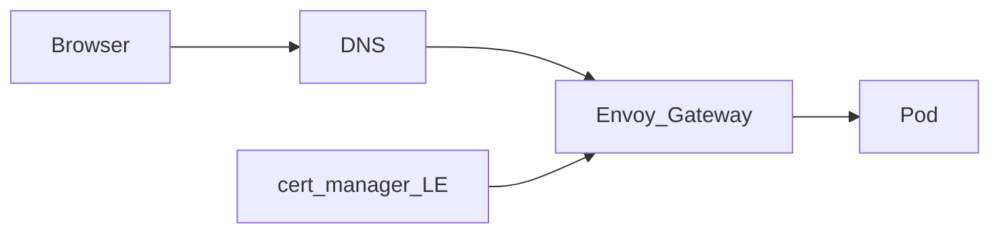

# Networking

Homelab VLAN (UniFi), DNS/TLS (`lab.jacobdrury.com`), and Tailscale. Leans: [decisions](../decisions.md).

## UniFi (homelab VLAN)

Dedicated **homelab VLAN**, isolated from trusted LAN / IoT, with **selective** allow rules (e.g. admin → lab; deny lab → sensitive VLANs by default).

### Unraid IP

| Approach | Verdict |
|----------|---------|
| **Static on Unraid** outside DHCP pool (e.g. `.10`) | **Preferred** — stable for NFS if controller is down |
| UniFi fixed IP / reservation only | Weaker at Unraid boot |
| Both | Optional niceness |

Example scheme (pick numbers that fit your UniFi site): `10.40.0.0/24`, DHCP `.100–.199`, Unraid `.10`, LB/VIP `.20`, nodes `.11+`.

### UniFi IaC

OpenTofu under `infrastructure/unifi/` (API key in 1Password). Community providers can manage networks and firewall (legacy rules vs zone policies depend on UniFi Network version — pin the provider).

- Start with: VLAN/network + DHCP range + a few allow/deny policies  
- UI-first is OK to unblock Unraid; codify afterward  
- Don’t IaC every Wi‑Fi tweak on day one  

## Domain & DNS

| | |
|--|--|
| Base zone | `lab.jacobdrury.com` (under `jacobdrury.com`) |
| Registrar today | Squarespace |
| DNS for automation | **Cloudflare** (Squarespace has no usable DNS API for LE) |
| Later | Transfer registration → Cloudflare Registrar |

**Preserve on cutover:** GitHub Pages for apex `jacobdrury.com` (`www` + A records; **DNS-only** / grey cloud).

### IaC (Cloudflare)

| Layer | Tool | Owns |
|-------|------|------|
| Static records | OpenTofu → `infrastructure/dns/` | Pages apex/`www`, zone settings |
| App hostnames (optional) | external-dns | From HTTPRoutes |
| ACME TXT | cert-manager | Ephemeral — not in Tofu |

### Environments → hostnames

| Env | When | Hostnames |
|-----|------|-----------|
| **prd** | Now | `*.lab.jacobdrury.com` (no `prd` in name) |
| **stg** | Later | `*.stg.lab.jacobdrury.com` |

## HTTPS

Envoy Gateway terminates TLS. **cert-manager + Let’s Encrypt DNS-01** via Cloudflare (token in 1Password).

- Use hostnames, not bare IPs  
- **LAN:** Pi-hole / UniFi DNS → Envoy on the lab VLAN  
- **Remote:** same names via Tailscale  
- Lean: **always Tailscale** for app DNS first; split-horizon later if wanted  
- **Not** public by default; add Cloudflare Tunnel / Funnel later if needed  

## Tailscale

| Piece | Role |
|-------|------|
| **K8s operator** | Primary — kube API + HTTPRoutes on the tailnet |
| **Unraid client** | Admin UI + same mesh |
| **Mac Mini client** | While it hosts Proxmox / agent workstation |
| **Subnet router** | Only if you need whole LAN without Tailscale on every device |

Free Personal is enough until you hit limits. Agents: [agents](agents.md).
