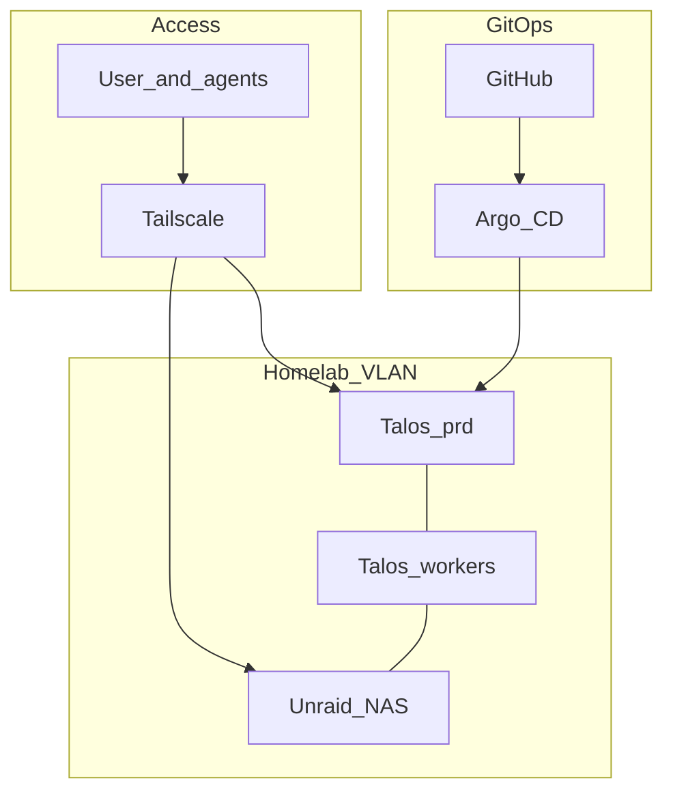

# Architecture overview

Ideal end state. Interim: Talos VMs on the Mac Mini; Unraid on Gaming PC #2. See [decisions](../decisions.md) for the full lean table.

## Design goals

- **Kubernetes** for app workloads (Talos Linux)
- **GitOps** — GitHub source of truth; Argo CD reconciles
- **Unraid** owns persistent storage (**NFS + iSCSI** to the cluster)
- **Private access** — homelab VLAN + Tailscale; no public app ingress by default
- **Declarative** machines and apps; minimize snowflakes
- **Gaming PC #1 out**; **PC #2 = Unraid**
- **Agent-operable** — Cursor/AI on the tailnet ([agents](agents.md))
- **`prd` first** — `stg` layout reserved for later

## Topology

## Hardware end state

| Machine | Role |
|---------|------|
| Gaming PC #1 | **Out of lab** — personal gaming |
| Gaming PC #2 | **Unraid** (bare metal); optional GPU worker VM later |
| Mac Mini | Interim Proxmox for Talos VMs; optional later |
| Mini PCs | Steady-state Talos nodes |
| Laptops | Optional / burst only |

## Non-goals (for now)

- Public internet exposure of the media stack  
- Ceph/Longhorn as primary storage  
- Full Talos control plane on Unraid (GPU-only worker VM is OK)  
- Running `stg` until you explicitly want a second cluster  
- Dependabot version updates (Renovate later)  

## Related

- [Platform](platform.md) · [Storage](storage.md) · [Networking](networking.md) · [GPU](gpu.md) · [Media](media.md) · [Secrets](secrets.md) · [Agents](agents.md)  
- [Roadmap](../roadmap.md) · [Inventory](../inventory.md)  
