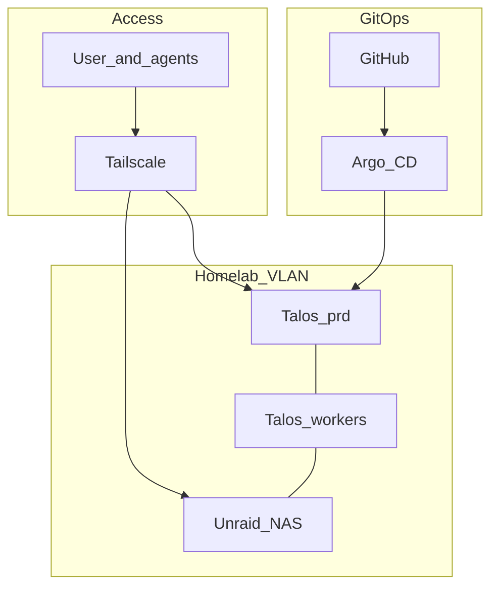

# Architecture overview

Ideal end state. Path: **Unraid first** → **Talos `prd` on Mini VMs** → **migrate apps once** → **3 bare-metal CPs** (Mini + 2 mini PCs) + free pc (black). See [decisions](../decisions.md) · [roadmap](../roadmap.md).

## Design goals

- **Kubernetes** for app workloads (Talos Linux); single-node `prd` OK until mini PCs
- **Steady cluster:** 3 control planes, workloads on all nodes
- **GitOps** — GitHub source of truth; Argo CD reconciles
- **Unraid** owns disks only (**NFS + iSCSI**); apps are not parked on Unraid Docker
- **Private access** — homelab VLAN + Tailscale; no public app ingress by default
- **Declarative** machines and apps; minimize snowflakes / re-migrations
- **pc (white) = Unraid**; **pc (black) → gaming** after cutover (retained during transition)
- **Agent-operable** — Cursor/AI on the tailnet ([agents](agents.md))
- **`prd` first** — `stg` layout reserved for later

## Topology

## Hardware end state

| Machine | Role |
|---------|------|
| pc (black) | **Out of lab** — personal gaming (after Phase 3–4) |
| pc (white) | **Unraid** bare metal; **no dGPU**; 24TB via UD → NFS/iSCSI |
| Mac Mini | Interim: Proxmox + Talos VM(s). Steady: **bare-metal Talos CP** (#1 of 3) |
| Mini PCs (×2) | Bare-metal Talos **control planes** (#2 and #3) |
| Laptops | Precision optional; Inspiron out of lab plan |

## Non-goals (for now)

- Public internet exposure of the media stack  
- Ceph/Longhorn as primary storage  
- Apps on Unraid Docker as a stepping stone to k8s  
- Dedicated worker-only nodes (all three CPs schedule pods)  
- Full Talos control plane on Unraid  
- Running `stg` until you explicitly want a second cluster  
- Dependabot version updates (Renovate later)  
- Buying a second large drive before Unraid is useful (UD path instead)  

## Related

- [Platform](platform.md) · [Storage](storage.md) · [Networking](networking.md) · [GPU](gpu.md) · [Media](media.md) · [Secrets](secrets.md) · [Agents](agents.md)  
- [Roadmap](../roadmap.md) · [Inventory](../inventory.md)  
