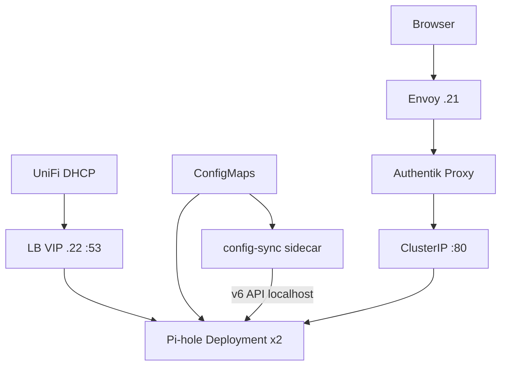

# Pi-hole

LAN DNS / ad blocking on Talos `prd`. Leans: [decisions](../decisions.md) · app: [apps/pihole](../../clusters/prd/apps/pihole/).

## Placement

| Piece | Choice |
|-------|--------|
| Runtime | Official `pihole/pihole:**2026.07.2**` (pinned digest), **Deployment** |
| Replicas | **2** with soft `podAntiAffinity` (may co-locate if one node is down) |
| State | **Stateless** — `emptyDir` for `/etc/pihole`; gravity rebuilt per pod |
| Config SoT | **ConfigMaps** in Git (`pihole-settings`, `pihole-policy`, `pihole-dnsmasq`) + sync sidecar |
| DNS | Cilium L2 LoadBalancer VIP **`192.168.5.22`** — UDP/TCP **53** (`Service/pihole-dns`) |
| Admin | ClusterIP `:80` → Envoy HTTPRoute + **Authentik Proxy** (lab ingress; not nginx Ingress) |

## Match to the common k8s recipe

| Blog / recipe | This lab |
|---------------|----------|
| Deployment ≥2 replicas | Yes |
| ConfigMaps for settings + lists | Yes |
| LoadBalancer DNS :53 TCP/UDP | Yes — Cilium L2 `.22` |
| ClusterIP admin :80 | Yes |
| Ingress for admin | **Envoy HTTPRoute + Authentik** (same role; lab standard) |

**Not** StatefulSet + OpenTofu dual-apply. ConfigMaps + sidecar replace Nebula Sync and multi-target TF.

## Why Cilium L2 for `.22` is OK (Envoy `.21` is not)

Envoy left Cilium L2 because **Tailscale FORWARD → L2 VIP on the same node hairpins**. Pi-hole VIP is **LAN DNS only**. Away clients use split DNS → Cloudflare. Admin UI uses Envoy `.21`, never Tailscale→`.22`. L2 `nodeSelector: {}` — do not pin to workers.

## Config maps

| ConfigMap | Purpose |
|-----------|---------|
| `pihole-settings` | `FTLCONF_*` via `envFrom` (upstreams, listeningMode, …) — **rollout** to apply |
| `pihole-policy` | Block/allow list URLs + per-domain allow/deny JSON — sidecar reconciles |
| `pihole-dnsmasq` | `*.lab` → Cloudflare forward + transitional `*.homelab.com` hosts |
| `pihole-sync` | Python reconciler (stdlib only) |

Do **not** edit lists in the UI — the sidecar reverts drift on the next loop.

## Stats (ephemeral)

Query counts, blocked totals, and history live in each pod’s FTL DB on `emptyDir` — **lost on restart** and **not merged** across replicas. Homepage has a **link only** (no Pi-hole widget).

**Follow-up:** scrape Pi-hole (or an exporter) with **Prometheus** and graph totals in Grafana so lab-wide DNS stats survive pod churn.

## Parallel soak (careful cutover)

| Path | Backend |
|------|---------|
| DHCP / LAN DNS | Still LXC **`192.168.1.11`** |
| k8s VIP | **`192.168.5.22`** — test with `dig @192.168.5.22` |
| `pihole.lab` UI | Transitional → LXC until HTTPRoute flip |

OpenTofu [`infrastructure/pihole/`](../../infrastructure/pihole/) stays **LXC-only** until DHCP cutover, then **retire** (policy lives in ConfigMaps).

## Auth (SSO) — after UI cutover

| Piece | Detail |
|-------|--------|
| Blueprint | `authentik/blueprints-pihole.yaml` |
| Route | `resources-pihole-routes.yaml` (include at cutover; remove transitional pihole route) |
| Skip paths | `/api` — Uptime Kuma (and any future API clients) |

## Cutover checklist

1. Reserve UniFi DHCP so nothing leases **`.22`**.
2. Confirm both pods Ready; `dig @192.168.5.22` + a blocked name.
3. Optional: `dhcp_dns = [.22, .11]` soak, then `[.22]` only.
4. Flip UI to Authentik route; remove transitional Backend.
5. `lab.yaml` `services.pihole.host` → `.22`; UniFi ZBF DNS targets → `.22`.
6. Stop LXC 106; archive/remove `infrastructure/pihole/` OpenTofu project.

## Related

- [networking](networking.md) · [agents](agents.md) · Cilium: `clusters/prd/platform/cilium/resources.yaml`
