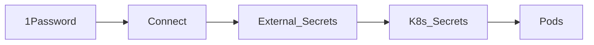

# Secrets (1Password)

Vault of record: **1Password** (already paid). Cluster path: Connect + External Secrets Operator. No plaintext secrets in Git; SOPS not required.

| Piece | Role |
|-------|------|
| 1Password vault (e.g. `Homelab`) | Tokens, DB passwords, Tailscale keys, Cloudflare/UniFi API |
| Connect | In-cluster API caching vault items |
| External Secrets | `ExternalSecret` CRs → native `Secret`s |
| Git | References only |

**Bootstrap:** seed Connect credentials into the cluster once (`kubectl` / script) — not committed in plaintext. After that Argo manages Connect/ESO and app secrets.

Agents use **`op` CLI** locally for break-glass tokens — [agents](agents.md).
