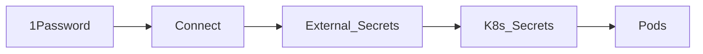

# Secrets (1Password)

Vault of record: **1Password** (already paid). Cluster path: Connect + External Secrets Operator. No plaintext secrets in Git; SOPS not required.

| Piece | Role |
|-------|------|
| 1Password vault (e.g. `Homelab`) | Tokens, DB passwords, Tailscale keys, Cloudflare/UniFi API |
| Connect | In-cluster API caching vault items |
| External Secrets | `ExternalSecret` CRs → native `Secret`s |
| Git | References only |

**Bootstrap:** seed Connect credentials into the cluster once (`kubectl` / script) — not committed in plaintext. After that Argo manages Connect/ESO and app secrets.

## Host shell access (SSH / sudo)

Separate from in-cluster secrets. Goal: **stop memorizing per-host passwords**; easy SSH during Phase 3 migrations.

| Piece | Role |
|-------|------|
| 1Password Homelab items | Per-host SSH/UI notes + **shared lab admin sudo password** |
| **1Password SSH agent** | Private keys stay in 1Password; pubkey on hosts |
| `connect/ssh/config` | Committed Host aliases (scarif, homelab02, **arr**, **home-assistant**, pihole, discord-bots) — **no** private keys in Git |
| Talos nodes | **No** classic SSH — `talosctl` via `connect/prd` |
| sudo | Password required; same rotated secret on hosts, stored in 1Password (not NOPASSWD for now) |

Phase 2 housekeeping checklist: [roadmap](../roadmap.md#phase-2-housekeeping--ssh--credentials). Prefer key auth for login; disable password SSH after keys work. Tailscale SSH is optional later.

Agents use **`op` CLI** locally for break-glass tokens — [agents](agents.md).
