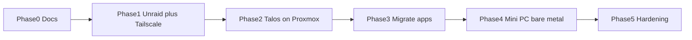

# Migration roadmap

Move from today's Proxmox + local HDD setup toward Talos + Unraid + Tailscale + Argo CD without a big-bang cutover.

## Principles

1. **Keep media available** — migrate storage before tearing down Jellyfin's disk
2. **Free Gaming PC #1** — nothing lab-critical may remain on it after Phase 1 (+ any VM moves)
3. **GitOps early** — once a cluster exists, new work goes through Git + Argo CD
4. **Proxmox is a bridge** — Talos VMs on **Mac Mini** first; mini PCs replace VMs later
5. **Tailscale first** — reachability via tailnet (and LAN); HTTPS via `lab.jacobdrury.com`, not public inbound by default

## Phase 0 — Inventory & docs (now)

- [x] Document current vs target ([current-state.md](./current-state.md), [target-architecture.md](./target-architecture.md))
- [ ] Fill hardware specs and which VM/LXC runs each service in current-state
- [x] Unraid hardware lean: **Gaming PC #2** (bare metal); PC #1 exits lab
- [ ] Create Tailscale account / tailnet if not already
- [ ] List everything still pinned to Gaming PC #1 (VMs, the 24TB, GPU assumptions)

**Exit:** Accurate inventory; PC #1 evacuation checklist known.

## Phase 1 — Unraid on PC #2 + evacuate PC #1 storage

Disk layout detail: [Unraid disk plan](./target-architecture.md#unraid-disk-plan-initial--protected).

- [ ] Put Tailscale on Mac Mini / always-on admin path
- [ ] Confirm SSD/NVMe available on PC #2 for `appdata` (buy if needed)
- [ ] Install **Unraid bare metal on Gaming PC #2** (USB license stick)
- [ ] Assign **24TB as sole array data disk** — **no parity yet**
- [ ] Decide 2TB role: download scratch / second data disk / hold (not parity)
- [ ] Create shares: `media/`, `downloads/`, `appdata/`, `backups/`
- [ ] Copy **24TB** libraries from PC #1 → Unraid `media/`
- [ ] Point existing Jellyfin at Unraid NFS/SMB — validate playback
- [ ] Export NFS for future CSI (`apps/` or `appdata/`, `media/`, `downloads/`)
- [ ] Migrate any Proxmox guests still on PC #1 → Mac Mini (or retire them)
- [ ] Wipe / reinstall Gaming PC #1 as a **gaming PC** (out of lab)

**Exit:** Media on Unraid (PC #2); Gaming PC #1 returned to gaming; lab no longer depends on PC #1.

### Phase 1b — parity when ready (can be anytime after Phase 1)

- [ ] Buy parity disk **≥ 24TB**
- [ ] Assign as Parity; wait for parity sync to complete
- [ ] Optional: add more mixed-size data disks over time; keep parity ≥ largest data disk

## Phase 2 — First Talos cluster (on Mac Mini Proxmox)

- [ ] Create Talos VMs on **Mac Mini** (start small: 1 control-plane + 1–2 workers)
- [ ] Store Talos machine configs in `infrastructure/`
- [ ] Install Cilium, NFS CSI, Tailscale operator (or subnet router)
- [ ] Install Argo CD; root Application → `clusters/stg` (add `clusters/prd` when second cluster exists)
- [ ] Deploy 1Password Connect + External Secrets Operator; seed Connect credentials once

**Exit:** Empty-but-GitOps cluster reachable over Tailscale; `kubectl` and Argo UI work from the tailnet.

## Phase 3 — Migrate apps (one stack at a time)

Order that usually hurts least:

1. **DNS** (Pi-hole / AdGuard) — plan LAN cutover carefully
2. ***arr + qBittorrent*** — config on Unraid NFS; verify downloads
3. **Jellyfin** — cut libraries already on Unraid; update clients
4. **Home Assistant** — last or keep on VM if USB radio is painful in k8s

For each app:

- [ ] Helm/Kustomize manifest in `apps/`
- [ ] Argo Application; sync
- [ ] Validate on Tailscale hostname
- [ ] Decommission old Proxmox guest

**Exit:** Current service list runs on k8s (or HA explicitly left on VM); old guests removed.

## Phase 4 — Bare-metal Talos (mini PCs)

- [ ] Buy / place mini PCs; image Talos
- [ ] Join as new nodes (or rebuild control plane onto bare metal)
- [ ] Drain and remove Proxmox-hosted Talos VMs on Mac Mini
- [ ] Decide Mac Mini’s leftover role (light Proxmox, HA USB host, or retire)

**Exit:** Cluster runs on mini PCs; Gaming PC #2 remains Unraid; PC #1 still gaming-only.

## Phase 5 — Hardening & ops (ongoing)

- [ ] Monitoring / alerting (Prometheus, Grafana, Discord/Slack)
- [ ] Backups (Unraid arrays + Velero or PVC snapshots + app DBs)
- [ ] Documentation for restore / node replace
- [ ] Only if needed: public HTTPS via Cloudflare Tunnel or Tailscale Funnel

## Dependency sketch

## Open decisions (track here)

| Decision | Options | Current lean |
|----------|---------|--------------|
| Unraid hardware | Gaming PC #2 bare metal | **PC #2 bare metal** |
| Unraid vs TrueNAS | Mixed drives vs ZFS-first | **Unraid** (mixed sizes; parity later) |
| Initial array | Parity now vs data-only first | **24TB data only**; parity (≥24TB) later |
| 2TB HDD | Parity / data / scratch | **Not parity**; scratch or extra data |
| Unraid virtualized? | VM on Proxmox vs bare metal | Bare metal (VM only as short bridge) |
| Gaming PC #1 | Stay in lab vs gaming | **Exit lab → gaming** |
| Lab GPU | Unraid Docker vs Talos worker passthrough | **Pattern B** — Talos worker(s) with GPU passthrough |
| Jellyfin GPU source | PC #2 dGPU / Mac Mini iGPU / Quadro laptop | Prefer **Mac Mini iGPU** first; PC #2 dGPU if needed; Quadro laptop optional if 24/7 |
| Control plane size | 1 vs 3 | 1 while learning on Mac Mini; 3 on mini PCs |
| DNS in cluster | Pi-hole vs AdGuard Home | TBD |
| Lab domain | MagicDNS only vs custom zone | **prd:** `*.lab.jacobdrury.com` (no env in name) · **stg:** `*.stg.lab.jacobdrury.com` |
| TLS | Self-signed vs Let’s Encrypt | **cert-manager + LE DNS-01** (private services, public trust) |
| App DNS path | Always Tailscale vs split-horizon | Start **always Tailscale**; split-horizon optional later |
| Home Assistant | In-cluster vs VM | Prefer VM if USB radio |
| Secrets | 1Password Connect + ESO | **Locked** — use existing 1Password; vault e.g. `Homelab` |
| Ingress | Traefik vs Envoy Gateway | **Envoy Gateway** + Gateway API (`HTTPRoute`) |

## Public HTTPS later?

Safe to stay Tailscale-only through Phases 1–4. Adding public access is an **edge** change (tunnel/Funnel + HTTPRoute), not a storage or node redesign. See [target-architecture.md](./target-architecture.md#adding-public-https-later).
