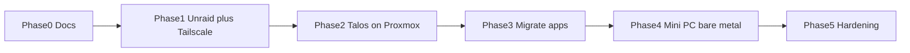

# Migration roadmap

Move from today's Proxmox + local HDD setup toward Talos + Unraid + Tailscale + Argo CD without a big-bang cutover.

## Principles

1. **Keep media available** — migrate storage before tearing down Jellyfin's disk
2. **Free Gaming PC #1** — nothing lab-critical may remain on it after Phase 1 (+ any VM moves)
3. **GitOps early** — once a cluster exists, new work goes through Git + Argo CD
4. **Proxmox is a bridge** — Talos VMs on **Mac Mini** first; mini PCs replace VMs later
5. **Tailscale first** — reachability via tailnet (and LAN); HTTPS via `lab.jacobdrury.com`, not public inbound by default

## Phase 0 — Inventory & docs (now)

- [x] Document current vs target ([current-state.md](./current-state.md), [target-architecture.md](./target-architecture.md))
- [x] Repo toolchain: **proto + moon** (`.prototools`, `.moon/`, root `moon.yml`)
- [ ] Fill hardware specs and which VM/LXC runs each service in current-state
- [x] Unraid hardware lean: **Gaming PC #2** (bare metal); PC #1 exits lab
- [x] Tailscale: account exists (free Personal OK)
- [x] Domain: Squarespace registrar → **Cloudflare DNS** for LE (needed)
- [x] DNS app: keep **Pi-hole**
- [x] Monitoring lean: Prometheus, Grafana, Uptime Kuma, Discord
- [ ] List everything still pinned to Gaming PC #1 (VMs, the 24TB)

**Exit:** Accurate inventory; PC #1 evacuation checklist known.

## Phase 1 — Unraid on PC #2 + evacuate PC #1 storage

Disk layout detail: [Unraid disk plan](./target-architecture.md#unraid-disk-plan-initial--protected).

- [ ] Put Tailscale on Mac Mini / always-on admin path
- [x] SSD/NVMe for Unraid `appdata` — available on PC #2
- [ ] Install **Unraid bare metal on Gaming PC #2** (USB license stick)
- [ ] Assign **24TB as sole array data disk** — **no parity yet**; SSD pool for `appdata`
- [ ] Create shares: `media/`, `downloads/`, `appdata/`, `backups/`
- [ ] Copy **24TB** libraries from PC #1 → Unraid `media/`
- [ ] Point existing Jellyfin at Unraid NFS/SMB — validate playback
- [ ] Export NFS for future CSI (`apps/` or `appdata/`, `media/`, `downloads/`)
- [ ] Migrate any Proxmox guests still on PC #1 → Mac Mini (or retire them)
- [ ] Wipe / reinstall Gaming PC #1 as a **gaming PC** (out of lab)

**Exit:** Media on Unraid (PC #2); Gaming PC #1 returned to gaming; lab no longer depends on PC #1.

### Phase 1b — parity when ready (can be anytime after Phase 1)

- [ ] Buy parity disk **≥ 24TB**
- [ ] Assign as Parity; wait for parity sync to complete
- [ ] Optional: add more mixed-size data disks over time; keep parity ≥ largest data disk

## Phase 2 — Talos clusters (stg + prd)

- [ ] Move **DNS** for `jacobdrury.com` to Cloudflare; keep Squarespace as registrar until transfer
- [ ] Recreate **GitHub Pages** apex/`www` records in Cloudflare so `jacobdrury.com` still serves the site
- [ ] Add OpenTofu Cloudflare DNS config in-repo (e.g. `infrastructure/dns/`)
- [ ] (**Later**) Transfer domain registration Squarespace → **Cloudflare Registrar**
- [ ] Create Talos VMs — aim for **both** `stg` and `prd` (start small on Mac Mini as needed)
- [ ] Store Talos machine configs in `infrastructure/stg` and `infrastructure/prd`
- [ ] Install Cilium, NFS CSI, **Tailscale operator**, Envoy Gateway, cert-manager
- [ ] Install Argo CD; roots → `clusters/stg` and `clusters/prd`
- [ ] Deploy 1Password Connect + External Secrets Operator; seed Connect credentials once
- [ ] Issue LE certs for `*.lab.jacobdrury.com` and `*.stg.lab.jacobdrury.com` via Cloudflare DNS-01

**Exit:** Both clusters GitOps-reachable over Tailscale; `kubectl` and Argo UI work from the tailnet.

## Phase 3 — Migrate apps (one stack at a time)

Order that usually hurts least:

1. **DNS (Pi-hole)** — plan LAN cutover carefully
2. ***arr + qBittorrent*** — config on Unraid NFS; verify downloads
3. **Jellyfin** — cut libraries already on Unraid; update clients
4. **Home Assistant** — when convenient (no hard cutover dependency)

For each app:

- [ ] Helm/Kustomize manifest in `apps/`
- [ ] Argo Application; sync
- [ ] Validate on Tailscale hostname
- [ ] Decommission old Proxmox guest

**Exit:** Current service list runs on k8s (or HA explicitly left on VM); old guests removed.

## Phase 4 — Bare-metal Talos (mini PCs)

- [ ] Buy / place mini PCs; image Talos
- [ ] Join as new nodes (or rebuild control plane onto bare metal)
- [ ] Drain and remove Proxmox-hosted Talos VMs on Mac Mini when bare metal is ready
- [ ] Mac Mini leftover role: optional (no HA USB requirement)

**Exit:** Cluster(s) on intended hardware; Gaming PC #2 remains Unraid; PC #1 still gaming-only.

## Phase 5 — Hardening & ops (ongoing)

- [ ] Monitoring: **Prometheus, Grafana, Uptime Kuma**; notifications to **Discord**
- [ ] Backups (tooling TBD — Unraid array + cluster/app backups)
- [ ] Documentation for restore / node replace
- [ ] Only if needed: public HTTPS via Cloudflare Tunnel or Tailscale Funnel

## Dependency sketch

## Open decisions (track here)

| Decision | Options | Current lean |
|----------|---------|--------------|
| Unraid hardware | Gaming PC #2 bare metal | **PC #2 bare metal** |
| Unraid vs TrueNAS | Mixed drives vs ZFS-first | **Unraid** |
| Initial array | Parity now vs data-only first | **24TB data only**; parity (≥24TB) later |
| 2TB HDD | In Unraid plan or not | **Out of plan** for now (may stay on PC #1) |
| Appdata disks | Buy SSD vs existing | **Existing NVMe/SATA SSDs on PC #2** |
| Gaming PC #1 | Stay in lab vs gaming | **Exit lab → gaming** |
| Lab GPU | Pattern B Talos worker passthrough | **Locked**; prefer Mac Mini iGPU first |
| Control plane size | 1 vs 3 | 1 while learning; 3 on mini PCs for `prd` later |
| Clusters | stg only vs both | **Both `stg` and `prd`** |
| DNS app | Pi-hole vs AdGuard | **Pi-hole** (keep) |
| Domain DNS | Squarespace → Cloudflare | **Cloudflare DNS + OpenTofu now**; **full registrar transfer to Cloudflare later** |
| TLS | cert-manager + LE DNS-01 | **Locked** (via Cloudflare) |
| App DNS path | Always Tailscale vs split-horizon | Start **always Tailscale** |
| Tailscale | Operator vs subnet router | **Operator** + Unraid on tailnet; subnet router only if needed |
| Home Assistant | Rush vs whenever | **Whenever** — no special USB on Mac Mini |
| Secrets | 1Password Connect + ESO | **Locked** |
| Ingress | Envoy Gateway | **Locked** |
| Monitoring | Stack choice | **Prometheus, Grafana, Uptime Kuma → Discord** |
| Backups | Tooling | **TBD** |
| Repo toolchain | Manual CLIs vs moonrepo | **proto + moon** ([moonrepo.dev](https://moonrepo.dev/)) |
| Dependency bots | Dependabot / Renovate | **Dependabot** for Actions + OpenTofu; Renovate later if we want `.prototools` PRs |

## Public HTTPS later?

Safe to stay Tailscale-only through Phases 1–4. Adding public access is an **edge** change (tunnel/Funnel + HTTPRoute), not a storage or node redesign. See [target-architecture.md](./target-architecture.md#adding-public-https-later).
