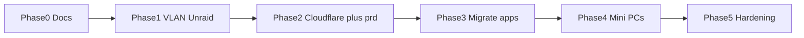

# Migration roadmap

Move from today's Proxmox + local HDD setup toward Talos + Unraid + Tailscale + Argo CD without a big-bang cutover.

## Principles

1. **Keep media available** — migrate storage before tearing down Jellyfin's disk
2. **Free Gaming PC #1** — nothing lab-critical may remain on it after Phase 1 (+ any VM moves)
3. **GitOps early** — once a cluster exists, new work goes through Git + Argo CD
4. **Proxmox is a bridge** — Talos VMs on **Mac Mini** first; mini PCs replace VMs later
5. **Tailscale first** — reachability via tailnet (and homelab VLAN); HTTPS via `lab.jacobdrury.com`
6. **`prd` first** — keep `stg` in the repo layout; don’t run a second cluster until you want one
7. **Agent-operable** — Cursor/AI agents on the tailnet can operate the lab (kubectl, APIs, GitOps); see [Agent access](./target-architecture.md#agent-access-first-class)

## Phase 0 — Inventory & docs (now)

- [x] Document current vs target ([current-state.md](./current-state.md), [target-architecture.md](./target-architecture.md))
- [x] Repo toolchain: **proto + moon** (`.prototools`, `.moon/`, root `moon.yml`)
- [ ] Fill hardware specs and which VM/LXC runs each service in current-state
- [x] Unraid hardware lean: **Gaming PC #2** (bare metal); PC #1 exits lab
- [x] Tailscale: account exists (free Personal OK)
- [x] Domain: Squarespace → **Cloudflare DNS** early (least rework for LE); registrar transfer later
- [x] DNS app: keep **Pi-hole**
- [x] Monitoring lean: Prometheus, Grafana, Uptime Kuma, Discord
- [x] Homepage on k8s (planned)
- [x] Clusters: **`prd` first**; `stg` optional later
- [x] Network: **UniFi homelab VLAN** + selective firewall; Unraid static IP
- [ ] List everything still pinned to Gaming PC #1 (VMs, the 24TB)

**Exit:** Accurate inventory; PC #1 evacuation checklist known.

## Phase 1 — Network + Unraid + evacuate PC #1

Disk layout: [Unraid disk plan](./target-architecture.md#unraid-disk-plan-initial--protected).  
VLAN/IP: [UniFi network](./target-architecture.md#unifi-network-homelab-vlan).

- [ ] Create **homelab VLAN** in UniFi (IaC later under `infrastructure/unifi/` is fine; UI-first OK to unblock)
- [ ] Choose subnet; set **Unraid static IP** outside DHCP pool (e.g. `.10`)
- [ ] Selective firewall: admin → lab; deny lab → sensitive VLANs by default
- [ ] Put Tailscale on Mac Mini / always-on admin path
- [x] SSD/NVMe for Unraid `appdata` — available on PC #2
- [ ] Buy **Unraid license** + USB stick
- [ ] Install **Unraid bare metal on Gaming PC #2** on the homelab VLAN
- [ ] Assign **24TB as sole array data disk** — **no parity yet**; SSD pool for `appdata`
- [ ] Create shares: `media/`, `downloads/`, `appdata/`, `backups/`
- [ ] Copy **24TB** libraries from PC #1 → Unraid `media/`
- [ ] Point existing Jellyfin at Unraid NFS/SMB — validate playback
- [ ] Export NFS for future CSI
- [ ] Migrate any Proxmox guests still on PC #1 → Mac Mini (or retire them)
- [ ] Wipe / reinstall Gaming PC #1 as a **gaming PC** (out of lab)

**Exit:** Media on Unraid (PC #2); PC #1 gaming-only; lab on dedicated VLAN.

### Phase 1b — parity when ready

- [ ] Buy parity disk **≥ 24TB**; assign; wait for sync
- [ ] Optional: more mixed-size data disks over time

### Phase 1c — backups (after Unraid is stable)

- [ ] Choose backup approach (parity ≠ backup) — options to evaluate: Unraid native / app dumps / restic-kopia / Velero later
- [ ] Document restore drill

## Phase 2 — Cloudflare DNS + Talos `prd`

- [ ] Move **DNS** for `jacobdrury.com` to Cloudflare; preserve **GitHub Pages** apex/`www`
- [ ] OpenTofu Cloudflare config in `infrastructure/dns/`
- [ ] (**Later**) Transfer registration → Cloudflare Registrar
- [ ] Create Talos VMs on Mac Mini for **`prd` only** (small CP + workers)
- [ ] Store configs in `infrastructure/prd/`; Argo root → `clusters/prd`
- [ ] Install Cilium, NFS CSI, **Tailscale operator**, Envoy Gateway, cert-manager
- [ ] 1Password Connect + External Secrets; seed once
- [ ] LE certs for `*.lab.jacobdrury.com` via Cloudflare DNS-01
- [ ] (**Later**) Optional `stg` cluster + `*.stg.lab.jacobdrury.com` if desired

**Exit:** `prd` GitOps-reachable on Tailscale + lab VLAN; `kubectl` / Argo UI work.

## Phase 3 — Migrate apps (one stack at a time)

1. **DNS (Pi-hole)** — plan LAN/VLAN cutover carefully  
2. ***arr + qBittorrent***  
3. **Jellyfin**  
4. **Homepage**  
5. **Home Assistant** — after Jellyfin / *arr; downtime OK; prefer in-cluster (USB radio passthrough if needed)  

For each: manifests in `apps/` → Argo → validate on `*.lab.jacobdrury.com` → retire old guest.

## Phase 4 — Bare-metal Talos (mini PCs)

- [ ] Buy / place mini PCs; image Talos; join/replace Mac Mini VMs
- [ ] Mac Mini leftover role: optional

## Phase 5 — Hardening & ops

- [ ] Monitoring: Prometheus, Grafana, Uptime Kuma → Discord  
- [ ] Tailscale on **agent workstation** (Mac running Cursor) so agents share lab access
- [ ] Document agent kubecontext + moon tool PATH in-repo (Cursor rule/skill)
- [ ] 1Password items for any agent-needed API tokens (HA, Unraid) — not in Git
- [ ] Optional: Kubernetes / HA MCP servers when shell-only gets painful

## Dependency sketch

## Open decisions (track here)

| Decision | Options | Current lean |
|----------|---------|--------------|
| Unraid hardware | Gaming PC #2 bare metal | **PC #2 bare metal** |
| Unraid license | Own vs buy | **Buy** with USB stick |
| Initial array | Parity now vs later | **24TB data only**; parity later |
| 2TB HDD | In plan or not | **Out of plan** for now |
| Clusters | stg+prd vs prd first | **`prd` first**; `stg` later if needed |
| DNS cutover timing | With Phase 2 vs earlier | **With Phase 2** (Cloudflare before cert-manager) — one cutover |
| Domain DNS | Squarespace → Cloudflare | **Cloudflare DNS + OpenTofu**; registrar transfer later |
| UniFi | Flat LAN vs lab VLAN | **Homelab VLAN** + selective allows |
| Unraid IP | DHCP reservation vs static | **Static on Unraid** outside DHCP pool (e.g. `.10`) |
| UniFi IaC | UI only vs OpenTofu | **OpenTofu later** (`infrastructure/unifi/`); UI OK to unblock |
| Tailscale | Operator vs subnet router | **Operator** + Unraid on tailnet |
| Backups | Tooling | **Decide after Unraid is up** (Phase 1c) |
| Monitoring | Stack | **Prometheus, Grafana, Uptime Kuma → Discord** |
| Homepage | In k8s or not | **In k8s** |
| Repo toolchain | moonrepo | **proto + moon** |
| Dependency bots | Renovate | **Later** (no Dependabot version updates) |
| Agent access | Ad hoc vs first-class | **First-class** — Tailscale + kubeconfig + lab HTTPS + `op`; GitOps preferred |

## Public HTTPS later?

Safe to stay private through Phases 1–4. Adding public access is an edge change. See [target-architecture.md](./target-architecture.md#adding-public-https-later).
