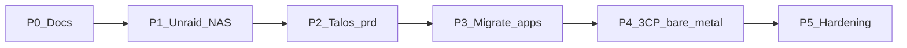

# Roadmap

Phased path from [inventory](inventory.md) → target. Principles and checklists only; leans live in [decisions](decisions.md).

## Sequence (locked)

1. **NAS first** — Unraid on pc (white); 24TB exposed via Unassigned Devices (no new large drive)  
2. **Cluster next** — Talos VMs on Mac Mini → `prd`  
3. **Migrate once** — apps to GitOps on `prd` when stable (not via Unraid Docker)  
4. **Expand later** — **3 bare-metal CPs** (Mini + 2 mini PCs); free pc (black) → gaming

pc (black) **stays in lab during transition** — arr serves media from **scarif NFS** until Phase 3 k8s cutover.

## Principles

1. **Unraid = storage only** — NFS/iSCSI to the cluster; apps land on k8s once (minimize redo)  
2. Media on **scarif NFS**; arr VM on pc (black) until `prd` cutover  
3. GitOps as soon as `prd` exists  
4. Mac Mini Proxmox hosts interim Talos VMs; steady state is **bare-metal Talos on Mini + 2 mini PCs**  
5. Single-node `prd` OK interim; steady = **3 control planes**, all schedule workloads  
6. Prefer **GitOps rebuild** to 3-CP over live etcd expansion when hardware arrives  
7. Tailscale + homelab VLAN; HTTPS via `lab.jacobdrury.com`  
8. **Agent-operable** — [agents](architecture/agents.md)  

## Phase 0 — Docs & inventory

- [x] Architecture / decisions / this roadmap  
- [x] proto + moon in repo  
- [x] [Inventory](inventory.md) specs + VM/LXC map  
- [x] Evacuation checklist known (VM 101 `arr`, VM 105 HA on pc black)  

**Exit:** Plan and inventory current.

## Phase 1 — Unraid owns the HDD

Details: [storage](architecture/storage.md) · [networking](architecture/networking.md).

**Goal:** NAS up; 24TB reachable over the network. pc (black) arr mounts NFS until Phase 3.

- [x] USB boot stick; Unraid license  
- [x] Wipe / install Unraid bare metal on **pc (white)**; hostname **`scarif`** ([naming](architecture/naming.md))  
- [x] Remove GTX 780 (unused; saves idle power)  
- [x] Unraid **static IP** outside DHCP pool (`.10`)  
- [ ] Homelab VLAN in UniFi (UI OK; Tofu later)  
- [ ] Firewall: admin → lab; deny lab → sensitive VLANs by default  
- [ ] SSD pool for `appdata` on 500 GB NVMe (optional now — **no array required**)  
- [x] Move **24TB** from pc (black) into pc (white) — **Unassigned Devices**, keep XFS, **not** in array  
- [x] NFS export UD mount (`/mnt/disks/ZXA0VZBA`)  
- [x] Smoke-test: arr VM + LAN mount; library readable  
- [ ] iSCSI target plugin + SSD/pool LUNs (can wait until cluster needs block PVCs)  
- [ ] Tailscale on Unraid (and Mac Mini always-on path)  

**Exit:** ~~Unraid is the NAS; 24TB exported.~~ **Done Aug 2025.** arr VM on NFS; black PC no longer holds the disk.

### Phase 1b — Array / parity (when you can)

Buy **data** drive(s) first; **24TB becomes parity** after library is copied off UD (assigning parity **wipes** the disk).

- [ ] Add **~12 TB** data drive (comfortable for **~8.7 TB** used today + growth; copy is **not** compressed)  
- [ ] Copy library UD → array share; validate playback  
- [ ] Remove 24TB from UD; assign as **parity** (≥ largest data disk)  
- [ ] Wait for parity sync if enabled  

### Phase 1c — Backups

- [ ] Choose approach after Unraid is stable  
- [ ] Document a restore drill  

## Phase 2 — Talos `prd` on Mac Mini

Build the cluster toward the end goal **before** migrating production apps.

- [ ] Cloudflare DNS for `jacobdrury.com`; keep GitHub Pages  
- [ ] OpenTofu `infrastructure/dns/` (can overlap)  
- [ ] Talos **VM(s)** on Mac Mini Proxmox — single-node `prd` OK; **`allowSchedulingOnControlPlanes`**  
- [ ] `infrastructure/prd` + Argo → `clusters/prd`  
- [ ] Cilium, NFS CSI (→ Unraid), iSCSI CSI when needed, Tailscale operator, Envoy, cert-manager  
- [ ] 1Password Connect + ESO; seed once  
- [ ] LE for `*.lab.jacobdrury.com`  
- [ ] Deploy a throwaway app; confirm GitOps + NFS path  

**Exit:** `prd` GitOps-reachable on Tailscale + VLAN; storage CSI talks to Unraid.

## Phase 3 — Migrate workloads (once stable)

Cut over from Proxmox guests → GitOps. **One landing** on k8s (not Unraid Docker first).

1. Pi-hole  
2. *arr + qBittorrent (Mullvad peers; UI at `qbittorrent.lab.jacobdrury.com`)  
3. Jellyfin (library on Unraid NFS; GPU/QSV **optional** — not needed for typical 720/1080 direct play)  
4. Homepage  
5. Home Assistant (after media; downtime OK)  

Each: `apps/` → Argo → `*.lab.jacobdrury.com` → retire old guest.

pc (black) retained until these are validated; then idle.

**Exit:** All listed apps on `prd`; old guests retired.

## Phase 4 — 3-node bare-metal cluster + free pc (black)

Target: **Mac Mini + 2 mini PCs**, all Talos **control planes**, all schedule pods. Details: [platform](architecture/platform.md#node-layout).

- [ ] Two mini PCs on hand; homelab VLAN + static/DHCP reservations  
- [ ] Prefer **fresh 3-CP bootstrap** (not live expand of Mini VM etcd); stable API DNS/VIP  
- [ ] `allowSchedulingOnControlPlanes: true` on all three  
- [ ] Talos machine configs in `infrastructure/prd/` for all three nodes  
- [ ] Argo points at new cluster; sync `clusters/prd` — validate apps  
- [ ] Retire Mac Mini Proxmox / old Talos VMs  
- [ ] Wipe pc (black) → personal gaming  

**Exit:** 3 Ready CPs; apps on GitOps; black out of lab.

## Phase 5 — Hardening

- [ ] Prometheus, Grafana, Uptime Kuma → Discord  
- [ ] Agent workstation Tailscale + kubecontext docs / Cursor rules  
- [ ] Agent API tokens in 1Password  
- [ ] Optional MCP  
- [ ] Renovate when ready  
- [ ] UniFi Tofu catch-up if VLAN was UI-first  
- [ ] Restore / node-replace docs  
- [ ] Public HTTPS only if needed  
