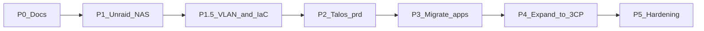
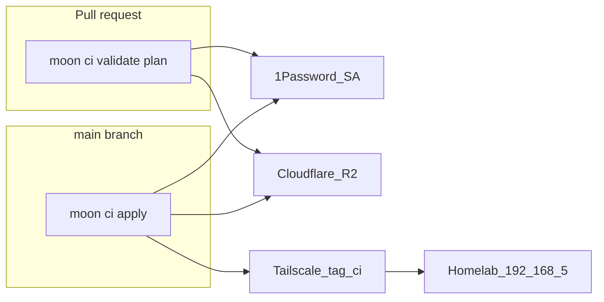

# Roadmap

Phased path from [inventory](inventory.md) → target. Principles and checklists only; leans live in [decisions](decisions.md).

## Current status (2026-09-14)

| Phase | State | Notes |
|-------|--------|--------|
| **0** Docs & inventory | **Done** | |
| **1** Unraid NAS | **Done** (Aug 2025) | scarif · 24TB UD · NFS |
| **1.5** VLAN + IaC | **Done** (Aug 2026) | scarif `192.168.5.10`; DNS/UniFi/Tailscale in Git |
| **1.5+** Remote access | **Done** (Aug 2026) | Tailscale IaC; interim subnet router on homelab02 |
| **2** Talos `prd` | **Done** | Platform + Homepage/Kuma/Authentik; Homelab via k8s Connector. Per-app CNPG kept (no lab-wide collapse) |
| **3** Migrate workloads | **Nearly done** | **Media + HA + Pi-hole** on k8s. Only **Pi-hole LXC 106** left to stop after DNS soak |
| **4–5** | Not started | |
| **6** | Not started | ATM10 + friend Tailscale access — [games](architecture/games.md) |

**IaC live today:** `infrastructure/cloudflare/`, `unifi/`, **`tailscale/`** — `moon run <project>:apply` on your Mac (**manual until [Phase 2b](#phase-2b--opentofu-ci-github-actions)**). Pi-hole policy = GitOps ConfigMaps. Policy: [iac](architecture/iac.md).

**DNS:** `*.lab.jacobdrury.com` in Cloudflare (`infrastructure/cloudflare/`). LAN: k8s Pi-hole VIP **`.22`** (DHCP on all VLANs) forwards `*.lab` → Cloudflare. Away: Tailscale split DNS → Cloudflare. **`arr.lab` / `arr.homelab.com` retired** (Sep 2026).

**Remote access (verified):** split DNS · Homelab VLAN via **k8s Connector**; Drury (`192.168.1.0/24`) still via homelab02 · policy/keys in `infrastructure/tailscale/`.

## What's next — Phase 3 wrap-up

Media, Home Assistant, and **Pi-hole** are on `prd`. Remaining soak guest:

| Guest | Action |
|-------|--------|
| arr VM **101** | **Stopped** / `onboot=0` |
| HA VM **105** | **Stopped** / `onboot=0` |
| discord-bots VM **103** | **Stopped** / retired (won't migrate) |
| Pi-hole LXC **106** | **Waiting** — stop after DNS soak (clients renew to `.22`) |

**Won't do:** lab-wide shared CNPG collapse (keep per-app clusters: `authentik-pg`, `media-pg`, HA Postgres).

**Deliberately later:** Prometheus / Grafana / Discord alert wiring — **Phase 5**. Optional anytime: array/parity ([Phase 1b](#phase-1b--array--parity-when-you-can)).

Tools: `cd connect/prd` · `moon run connect:sync` · [tailscale README](../infrastructure/tailscale/README.md).

## Sequence (locked)

1. **NAS first** — Unraid on pc (white); 24TB exposed via Unassigned Devices (no new large drive)  
2. **Network + IaC** — homelab VLAN (OpenTofu) + Cloudflare DNS (OpenTofu) **before** Talos  
3. **Cluster** — **bare-metal Talos** on Mac Mini (**yavin**) → single-node `prd`  
4. **Migrate once** — apps to GitOps on `prd` (**Pi-hole last**)  
5. **Expand later** — join **hoth** + **endor** as CPs (**1→3**); free pc (black) → gaming

pc (black) **stays in lab during transition** — media + HA + Pi-hole cutovers **done**; stop Pi-hole LXC after DNS soak, then free the box in Phase 4.

## Principles

1. **Unraid = storage only** — NFS/iSCSI to the cluster; apps land on k8s once (minimize redo). **Exception:** interim Talos worker **naboo** on scarif for compute headroom  
2. Media on **scarif NFS**; cluster pods mount it (arr VM retired after cutover)  
3. GitOps as soon as `prd` exists  
4. **Bare-metal Talos on yavin first** — retire Mac Mini Proxmox; expand to **3 CPs** when mini PCs arrive  
5. Single-node `prd` OK at bootstrap; steady = **3 control planes**, all schedule workloads  
6. **Expand cluster in place** (shared secrets + stable API endpoint from day one) — not a full rebuild  
7. Media stays on **scarif NFS**; cluster holds apps only  
8. **No HA** until 3 CPs; planned downtime is acceptable  
9. **Homelab VLAN + OpenTofu before Talos** — no bare-metal bootstrap on flat LAN  
10. **Pi-hole last** — ~~stays on pc (black) through Phase 2–3 until k8s cutover~~ **done** (Sep 2026) — VIP `.22`  
11. Tailscale + HTTPS via `lab.jacobdrury.com` — split DNS, subnet router on **k8s operator** (homelab02 interim); LE DNS-01 on Envoy  
12. **Agent-operable** — [agents](architecture/agents.md)  
13. **OpenTofu apply manual until cluster CI** — `moon run …:apply` from Mac through Phase 1.5–2; shift to GitHub Actions + in-cluster runners in Phase 2b  

## Phase 0 — Docs & inventory

- [x] Architecture / decisions / this roadmap  
- [x] proto + moon in repo  
- [x] [Inventory](inventory.md) specs + VM/LXC map  
- [x] Evacuation checklist known (VM 101 `arr`, VM 105 HA on pc black)  

**Exit:** Plan and inventory current.

## Phase 1 — Unraid owns the HDD

Details: [storage](architecture/storage.md) · [networking](architecture/networking.md).

**Goal:** NAS up; 24TB reachable over the network. pc (black) arr mounts NFS until Phase 3.

- [x] USB boot stick; Unraid license  
- [x] Wipe / install Unraid bare metal on **pc (white)**; hostname **`scarif`** ([naming](architecture/naming.md))  
- [x] Remove GTX 780 (unused; saves idle power)  
- [x] Unraid **static IP** outside DHCP pool (`192.168.5.10` on Homelab VLAN)  
- [ ] SSD pool for `appdata` on 500 GB NVMe (optional now — **no array required**)  
- [x] Move **24TB** from pc (black) into pc (white) — **Unassigned Devices**, keep XFS, **not** in array  
- [x] NFS export UD mount (`/mnt/disks/ZXA0VZBA`)  
- [x] Smoke-test: arr VM + LAN mount; library readable  
- [ ] iSCSI target plugin + SSD/pool LUNs — **do in Phase 2 housekeeping** (with NFS CSI)  

**Exit:** ~~Unraid is the NAS; 24TB exported.~~ **Done Aug 2025.** arr VM on NFS; black PC no longer holds the disk.

### Phase 1.5 — Homelab VLAN + OpenTofu (gate before Talos)

Details: [networking](architecture/networking.md) · [preflight](setup/phase-1.5-preflight.md) · [iac](architecture/iac.md). **Exit criteria for Phase 2.**

- [x] OpenTofu: **`infrastructure/cloudflare/`** — GitHub Pages (import) + infra `*.lab` records (applied 2026-08-29)
- [x] OpenTofu: **`infrastructure/unifi/`** — **Homelab** VLAN 5 + firewall (applied 2026-08-29)
- [x] OpenTofu: **`infrastructure/pihole/`** — lists, domains, upstreams, local DNS, lab zone forward (applied 2026-08-29; **retired** 2026-09 → k8s ConfigMaps)
- [x] Cloudflare active; API token in 1Password
- [x] UniFi API key in 1Password
- [x] Pi-hole API app-password + `app_sudo` in 1Password / UI
- [x] Switch: assign scarif port to **Homelab** VLAN 5 (Aggregation **SFP+ 2**; applied 2026-08-30)
- [x] Migrate **scarif** to `192.168.5.10` (**eth1** 10G; bonding/bridging off); arr VM NFS fstab → `scarif.lab.jacobdrury.com` (`_netdev,nofail` — no automount with Docker)
- [x] Re-validate NFS: arr VM → scarif export over homelab VLAN; Jellyfin playback OK
- [x] OpenTofu: **`infrastructure/tailscale/`** — split DNS → Cloudflare, ACL, homelab02 routes, k8s operator preauth key (applied 2026-08-30)
- [x] homelab02 **advertise-routes**; remote `http://scarif.lab.jacobdrury.com` verified on tailnet

**Exit:** ~~Lab hosts on homelab VLAN; DNS, network, and Pi-hole policy in Git.~~ **Done Aug 2026.** scarif live on `.5.10`; `*.lab` resolves on LAN and away; interim remote access via homelab02 subnet router.

### Phase 1b — Array / parity (when you can)

Buy **data** drive(s) first; **24TB becomes parity** after library is copied off UD (assigning parity **wipes** the disk).

- [ ] Add **~12 TB** data drive (comfortable for **~8.7 TB** used today + growth; copy is **not** compressed)  
- [ ] Copy library UD → array share; validate playback  
- [ ] Remove 24TB from UD; assign as **parity** (≥ largest data disk)  
- [ ] Wait for parity sync if enabled  

### Phase 1c — Backups

- [ ] Choose approach after Unraid is stable  
- [ ] Document a restore drill  

## Phase 2 — Bare-metal Talos `prd` on **yavin** (Mac Mini)

**Prerequisite:** Phase **1.5** complete (homelab VLAN + OpenTofu DNS/UniFi/Pi-hole + scarif on VLAN 5).

**Proxmox prep (done Aug 2026):** **homelab03** removed from cluster (`pvecm delnode`); **homelab02** single-node (`pvecm expected 1`); stale `corosync.conf` nodelist trimmed. Mac Mini can be wiped without affecting black’s guests.

Wipe Proxmox → Talos bare metal. **Mac Mini has no guests** (evacuated to homelab02) — wipe does not affect Pi-hole, discord bots, arr, or HA. Bootstrap **single-node `prd`** designed to **expand to 3 CPs** later.

- [x] Proxmox: **homelab03** delnode'd; **homelab02** standalone single-node (Aug 2026)
- [x] Boot-test / install Talos **1.12.7** on yavin (1.13+ hangs on 2018 Apple EFI)  
- [x] Custom image: **`intel-ucode`**, **`i915`**, `realtek-firmware`  
- [x] Machine config: USB 2.5G primary + onboard 1G secondary; Homelab VLAN; `192.168.5.11` / `.111`  
- [x] API endpoint: **`k8s.lab.jacobdrury.com`**  
- [x] Cluster secrets + `infrastructure/talos/prd/`; bootstrap; **`allowSchedulingOnControlPlanes: true`**  
- [x] Cilium  
- [x] **`connect/`** — `cd connect/prd` (direnv) + `moon run connect:sync`  
- [x] **naboo** — Unraid KVM Talos **worker** on scarif (`192.168.5.14`); 500 GB NVMe vdisk; 6 vCPU / 20 GB; joined `prd` (Sep 2026)  
- [x] UniFi **Zone-Based Firewall** — zones Drury / Homelab / Isolated; Homelab→Drury = Pi-hole DNS only; Pi-hole `listeningMode=ALL`  
- [x] **Housekeeping storage** — NFS + iSCSI CSI (`scarif-nfs`, `scarif-iscsi`); SSH deferred  
- [x] 1Password Connect + ESO; seed once (`onepassword` + `external-secrets`)  
- [x] Argo CD → `clusters/prd` (app-of-apps root; UI now `https://argocd.lab`)  
- [x] Envoy + cert-manager; LE wildcard `*.lab.jacobdrury.com` (VIP `192.168.5.21` — host address on yavin; was Cilium L2)  
- [x] **Shared MariaDB** — `platform/mariadb/`; Uptime Kuma consumer  
- [x] **Per-app CNPG** — Authentik / media / HA each keep their own Cluster (**won't** collapse to one lab Postgres)  
- [x] **Tailscale operator** on `prd` — Connector advertises `192.168.5.0/24`; Homelab route off homelab02 admin  
- [x] **Transitional HTTPRoutes** — Envoy proxies to legacy VMs/LXCs; media routes cut over to in-cluster Services (Sep 2026)  
- [x] **Homepage** via Argo (+ Uptime Kuma)  
- [x] **Authentik** at `auth.lab`  
- [x] **metrics-server**  
- [x] **etcd snapshot cadence** — CronJob every 6h → `scarif-iscsi` PVC (keep 14)  
- [x] Confirm GitOps + CSI + **`https://*.lab`** on LAN and away via Tailscale (Homelab via k8s Connector)  

**Defer:** Prometheus / Grafana / Discord alerts → [Phase 5](#phase-5--hardening). Bootstrap troubleshooting: **`connect/`**, k9s, talosctl (no early metrics stack on 16 GB yavin).

### Phase 2 housekeeping — SSH & credentials

Do this for break-glass + migration SSH predictability. Scope is **light** — not Tailscale SSH or a full IdM. (**naboo** already joined; SSH housekeeping no longer blocks the worker.)

**Hosts (SSH Host entries + 1Password items):**

| Host | Address | Notes |
|------|---------|--------|
| **scarif** | `192.168.5.10` | Unraid root / UI |
| **homelab02** | `192.168.1.12` | Proxmox |
| **arr** | `192.168.1.9` | VM 101 — **stopped** / `onboot=0`; media configs archived |
| **home-assistant** | `192.168.2.8` | VM 105 — **stopped** / `onboot=0`; live HA is k8s |
| **pihole** | `192.168.1.11` | LXC 106 — stop after DNS soak |
| **discord-bots** | `192.168.1.18` | VM 103 — **stopped** / retired (won't migrate) |

Skip Talos (**yavin** / **naboo**) — use `talosctl` via `connect/prd`.

**Checklist:**

- [ ] 1Password **Homelab** vault: backup Talos `secrets.yaml` + `talosconfig`; commit in-repo bootstrap work when ready  
- [ ] Create / refresh 1Password items for every host above (SSH user, UI passwords, notes)  
- [ ] **Rotate sudo/admin password** to one shared lab admin secret in 1Password; set that password on each host so sudo is in sync (stop relying on forgotten per-box passwords)  
- [ ] **1Password SSH agent** + one lab pubkey; install on those hosts; prefer key auth for login  
- [ ] `connect/ssh/config` — committed Host entries for the table above (no private keys in Git); document Include / usage in `connect/README`  
- [ ] Disable password SSH where keys work (keep the 1Password admin password for sudo + break-glass until verified)  

**sudo policy (locked):** password required; stored in **1Password** (shared lab admin secret rotated onto hosts). Not NOPASSWD for now.

**Later / optional:** Tailscale SSH; per-host sudo secrets if shared admin becomes uncomfortable; Phase 5 harden further.

### Phase 2 housekeeping — storage (CSI)

Stand up **both** StorageClasses during housekeeping so apps can choose RWX vs RWO from day one. Node-local disks are **not** for app state — pods stay movable across **yavin** / **naboo**.

| Class | Backend | Access | Use |
|-------|---------|--------|-----|
| NFS CSI | scarif export (UD media today) | **RWX** | Libraries, downloads, shared files |
| iSCSI CSI | scarif **SSD pool** LUNs | **RWO** | SQLite/config (*arr), Postgres per-replica, Pi-hole per-replica, games |

**Multi-replica rule:** one **RWO PVC per pod** (StatefulSet) — not one shared disk for 3 Pi-hole / 3 Postgres. Replication is app-level; NFS is not for concurrent SQLite.

**Checklist:**

- [x] Install **NFS CSI** → `scarif-nfs` (`clusters/prd/platform/nfs-csi/`); smoke Pod `touch` as uid `99` / gid `100` (Sep 2026)  
- [x] scarif: ZFS pool **`scarif-ssd`** (500 GB SATA) + `k8s/vols` / `k8s/snaps` (Sep 2026)  
- [x] scarif: **iSCSI Target** plugin (targetcli)  
- [x] Talos: `iscsi-tools` on **yavin** + **naboo** (schematic `b61bec70…`)  
- [x] Install **iSCSI CSI** → `scarif-iscsi` (`clusters/prd/platform/iscsi-csi/`); smoke Pod RWO write/delete (Sep 2026)  
- [ ] Document which class apps use (media → NFS; config/DB → iSCSI) in `apps/` / storage docs  
- [ ] Confirm no local-path / hostPath provisioner for real apps  
- [ ] SSH/sudo break-glass — **deferred** (optional before pc black leaves)  

**Exit (housekeeping):** **NFS + iSCSI** StorageClasses ready and smoke-tested — **done**. Secrets + Argo **done**. Next: Envoy → apps. (**naboo** online. SSH optional.)

**Exit (Phase 2):** `prd` GitOps-reachable on Tailscale + VLAN; **`https://*.lab`** works home and away (incl. **proxied** jellyfin/*arr/HA/scarif as needed); storage CSI live; **naboo** worker online; **Homepage** live; cluster ready to accept CP joins.

### Phase 2 — transitional `*.lab` routes

**Goal:** lock consumer URLs **before** apps move to k8s. Envoy terminates TLS; backends stay on pc (black) / Unraid until Phase 3 cutover.

| Hostname | Backend (Sep 2026) | Notes |
|----------|--------------------|-------|
| `jellyfin.lab.jacobdrury.com` | Jellyfin Service in `media` | Cut over; SQLite on iSCSI |
| `qbittorrent.lab…` | qBit Service (+ Authentik) | Cut over; Mullvad WG sidecar |
| `sonarr` / `sonarr-tv` / `prowlarr` | *arr Services (+ Authentik) | Cut over; `media-pg` |
| `homeassistant.lab…` | HA Service in `home-assistant` (+ Authentik OIDC) | **Cut over** (Sep 2026) |
| `scarif.lab…` | Unraid via Envoy | NAS stays |
| `pihole.lab…` | Pi-hole Service (+ Authentik) | **Cut over** (Sep 2026) — VIP `.22` |
| `proxmox.lab…` | homelab02 `:8006` (transitional) | Stays until black PC retires |
| `lab.jacobdrury.com` / `argocd.lab…` | Homepage / Argo | In-cluster |

**Pattern:** Cloudflare A → Envoy VIP → HTTPRoute → Service (in-cluster) or Backend (legacy IP:port). Cutover = retarget the route only — bookmarks unchanged.

Populate **Homepage** from these names as soon as routes exist.

### Phase 2b — OpenTofu CI (GitHub Actions)

**Goal:** `plan` / `validate` on PRs; `apply` on `main` via **`moon ci`**. State in **Cloudflare R2**. LAN apps via **Tailscale on GHA** (`tag:ci`) — not ARC.

Setup runbook: [opentofu-ci](setup/opentofu-ci.md). Workflow: [`.github/workflows/tofu.yml`](../.github/workflows/tofu.yml).

#### Checklist

- [x] OpenTofu modules in Git; apply from Mac (`moon`)
- [x] Remote state — R2 bucket `homelab-tofu-state` + migrate all projects
- [x] Workflow — `moon ci` on `ubuntu-latest` (plan on PR, apply on `main`)
- [x] Secrets — 1Password SA → `OP_SERVICE_ACCOUNT_TOKEN` only in GitHub (see setup doc)
- [x] Tailscale ACL — `tag:ci` + least-privilege grants; Drury/homelab02 routes retired
- [x] UniFi API — `https://192.168.5.1` (Homelab gateway)
- [x] GitHub `OP_SERVICE_ACCOUNT_TOKEN` (1Password SA **Homelab CI**, item in Homelab vault)
- [x] Create **Tailscale CI OAuth** 1Password item (Kuma via Tailscale L7 Ingress — no CI kubeconfig)
- [ ] First PR green plan; merge apply matches Mac (no drift)
- [ ] Mac `moon run …:apply` becomes break-glass only

**Exit:** All OpenTofu projects plan on PR; apply via pipeline; local state retired.

**Non-goal:** ARC / self-hosted runners (replaced by Tailscale-on-GHA).

## Phase 3 — Migrate workloads (once stable)

Cut over workloads → GitOps on `prd`. Remaining Proxmox guests on **pc (black)** are soak/retire only. **One landing** on k8s (not Unraid Docker first).

1. ~~*arr + qBittorrent (Mullvad WG sidecar + config copy; Authentik Proxy; `media-pg`)~~ **done** — see [media](architecture/media.md)  
2. ~~Jellyfin (library on **scarif NFS**; SQLite on iSCSI; GPU/QSV optional)~~ **done** — `apps/media/jellyfin.yaml`  
   - arr VM **stopped** / `onboot=0`; `arr.lab` + `arr.homelab.com` DNS retired  
3. ~~Home Assistant (Container + CNPG recorder + Authentik OIDC)~~ **done** — [home-assistant](architecture/home-assistant.md); VM **105** stopped  
4. ~~Discord bots~~ **won't migrate** — VM **103** stopped / retired  
5. ~~**Pi-hole** — final cutover from LXC → k8s~~ **done** (Sep 2026) — VIP `.22`, ConfigMaps, Authentik UI; stop LXC **106** after DNS soak  

**Already on cluster:** Homepage, Uptime Kuma, full **media** stack, **Home Assistant**, **Pi-hole**; **`*.lab` URLs** on Envoy.

Each migrate: `apps/` → Argo → `*.lab.jacobdrury.com` → retire old guest.

pc (black) retained until Pi-hole LXC is stopped; then idle / gaming (Phase 4).

**Exit:** Listed apps on `prd`; soak guests retired (discord bots deleted, not migrated).

## Phase 4 — Expand to 3 CPs + free pc (black)

Target: **yavin + hoth + endor**, all Talos **control planes**, all schedule pods. **Join** the existing cluster (**1→3**, not 1→2). Details: [platform](architecture/platform.md#node-layout).

- [ ] Two mini PCs on hand; homelab VLAN + static/DHCP reservations  
- [ ] Same Talos version + extensions on all nodes  
- [ ] Boot Talos on **hoth** / **endor** → apply `controlplane` join configs (shared secrets + API endpoint)  
- [ ] `allowSchedulingOnControlPlanes: true` on all three  
- [ ] Talos machine configs in `infrastructure/talos/prd/` per node  
- [ ] API endpoint: DNS or VIP survives expansion (no kubeconfig IP churn)  
- [ ] Validate etcd health + rolling workload placement across CPs  
- [ ] **Drain + remove naboo** (interim scarif worker VM no longer needed)  
- [ ] Wipe pc (black) → personal gaming  

**Exit:** 3 Ready CPs; same cluster + GitOps; naboo gone; black out of lab.

## Phase 5 — Hardening

- [ ] Prometheus + Grafana → Discord (full metrics; deferred from Phase 2 — yavin RAM / bootstrap used CLI tooling)  
- [ ] Wire Uptime Kuma (already deployed post-Argo) alerts → Discord if not done earlier  
- [ ] Agent workstation Tailscale + kubecontext docs / Cursor rules  
- [ ] Agent API tokens in 1Password  
- [ ] Optional MCP  
- [ ] Renovate when ready  
- [ ] Restore / node-replace docs  
- [ ] Public HTTPS only if needed  

## Phase 6 — Games (ATM10)

**Goal:** Minecraft **All the Mods 10** for friends on `prd`; friends use **Tailscale MagicDNS** (`jellyfin` + `minecraft` on `*.ts.net`), not `*.lab` URLs. Full design: [games](architecture/games.md).

**Does not block Phases 2–5.** Prefer deploying after **hoth** / **endor** join (Phase 4) so ATM10 can pin to the beefiest node.

### Prerequisites (by earlier phase)

| Phase | Prerequisite for ATM10 |
|-------|------------------------|
| 1 optional | scarif SSD pool + iSCSI LUN |
| 2 | Tailscale k8s operator; iSCSI CSI; `iscsi-tools` on Talos nodes |
| 3 | ~~Jellyfin on k8s~~ **done** (friend Tailscale L7 still Phase 6) |
| 4 | Node with **12+ GB RAM free** for the ATM10 pod (likely hoth or endor) |
| 5 | PVC backup approach chosen |

### Checklist

- [ ] Confirm target node CPU/RAM; set `nodeSelector` in manifests  
- [ ] scarif iSCSI LUN + StorageClass; 80 Gi PVC for world data  
- [ ] `apps/games/minecraft-atm10/` → Argo Application in `clusters/prd/`  
- [ ] ESO: CurseForge API key, RCON password (1Password)  
- [ ] Jellyfin **Tailscale L7 Ingress** (`ingress-friends.yaml`) + HTTPS enabled on tailnet — not Service `expose`  
- [ ] Minecraft Service: Tailscale **L3** `expose` + `tailscale.com/hostname: minecraft`  
- [ ] Tighten `infrastructure/tailscale/acl.tf` — `group:friends` → `tag:shared` only; remove allow-all grant  
- [ ] Auth keys for friends (`tag:friend`); share `https://jellyfin.ibex-ladon.ts.net` + `minecraft.ibex-ladon.ts.net:25565`  
- [ ] Minecraft whitelist; Jellyfin accounts for each friend  
- [ ] Smoke-test: friend on tailnet (no `--accept-routes`) reaches both services, not Argo/Unraid  
- [ ] Backup drill for game PVC  

**Exit:** Friends play ATM10 and watch Jellyfin over Tailscale; no access to rest of homelab.
