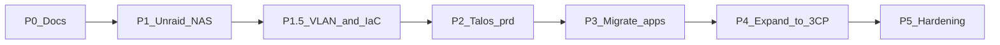

# Roadmap

Phased path from [inventory](inventory.md) → target. Principles and checklists only; leans live in [decisions](decisions.md).

## Sequence (locked)

1. **NAS first** — Unraid on pc (white); 24TB exposed via Unassigned Devices (no new large drive)  
2. **Network + IaC** — homelab VLAN (OpenTofu) + Cloudflare DNS (OpenTofu) **before** Talos  
3. **Cluster** — **bare-metal Talos** on Mac Mini (**yavin**) → single-node `prd`  
4. **Migrate once** — apps to GitOps on `prd` (**Pi-hole last**)  
5. **Expand later** — join **hoth** + **endor** as CPs (**1→3**); free pc (black) → gaming

pc (black) **stays in lab during transition** — arr serves media from **scarif NFS** until Phase 3 k8s cutover.

## Principles

1. **Unraid = storage only** — NFS/iSCSI to the cluster; apps land on k8s once (minimize redo)  
2. Media on **scarif NFS**; arr VM on pc (black) until `prd` cutover  
3. GitOps as soon as `prd` exists  
4. **Bare-metal Talos on yavin first** — retire Mac Mini Proxmox; expand to **3 CPs** when mini PCs arrive  
5. Single-node `prd` OK at bootstrap; steady = **3 control planes**, all schedule workloads  
6. **Expand cluster in place** (shared secrets + stable API endpoint from day one) — not a full rebuild  
7. Media stays on **scarif NFS**; cluster holds apps only  
8. **No HA** until 3 CPs; planned downtime is acceptable  
9. **Homelab VLAN + OpenTofu before Talos** — no bare-metal bootstrap on flat LAN  
10. **Pi-hole last** — stays on pc (black) through Phase 2–3 until k8s cutover  
11. Tailscale + HTTPS via `lab.jacobdrury.com`  
12. **Agent-operable** — [agents](architecture/agents.md)  

## Phase 0 — Docs & inventory

- [x] Architecture / decisions / this roadmap  
- [x] proto + moon in repo  
- [x] [Inventory](inventory.md) specs + VM/LXC map  
- [x] Evacuation checklist known (VM 101 `arr`, VM 105 HA on pc black)  

**Exit:** Plan and inventory current.

## Phase 1 — Unraid owns the HDD

Details: [storage](architecture/storage.md) · [networking](architecture/networking.md).

**Goal:** NAS up; 24TB reachable over the network. pc (black) arr mounts NFS until Phase 3.

- [x] USB boot stick; Unraid license  
- [x] Wipe / install Unraid bare metal on **pc (white)**; hostname **`scarif`** ([naming](architecture/naming.md))  
- [x] Remove GTX 780 (unused; saves idle power)  
- [x] Unraid **static IP** outside DHCP pool (`.10` on flat LAN today)  
- [ ] SSD pool for `appdata` on 500 GB NVMe (optional now — **no array required**)  
- [x] Move **24TB** from pc (black) into pc (white) — **Unassigned Devices**, keep XFS, **not** in array  
- [x] NFS export UD mount (`/mnt/disks/ZXA0VZBA`)  
- [x] Smoke-test: arr VM + LAN mount; library readable  
- [ ] iSCSI target plugin + SSD/pool LUNs (can wait until cluster needs block PVCs)  
- [ ] Tailscale on Unraid (and Mac Mini always-on path)  

**Exit:** ~~Unraid is the NAS; 24TB exported.~~ **Done Aug 2025.** arr VM on NFS; black PC no longer holds the disk.

### Phase 1.5 — Homelab VLAN + OpenTofu (gate before Talos)

Details: [networking](architecture/networking.md) · [preflight](setup/phase-1.5-preflight.md). **Exit criteria for Phase 2.**

- [ ] OpenTofu: **`infrastructure/dns/`** — GitHub Pages (import) + infra `*.lab` records  
- [ ] OpenTofu: **`infrastructure/unifi/`** — **Homelab** VLAN 5 + firewall  
- [x] Cloudflare active; API token in 1Password  
- [x] UniFi API key in 1Password  
- [ ] Migrate **scarif** to `192.168.5.10`; update arr VM NFS fstab  
- [ ] Re-validate NFS: arr VM → scarif export  

**Exit:** Lab hosts on homelab VLAN; DNS and network managed in Git via OpenTofu; `k8s.lab.jacobdrury.com` resolves.

### Phase 1b — Array / parity (when you can)

Buy **data** drive(s) first; **24TB becomes parity** after library is copied off UD (assigning parity **wipes** the disk).

- [ ] Add **~12 TB** data drive (comfortable for **~8.7 TB** used today + growth; copy is **not** compressed)  
- [ ] Copy library UD → array share; validate playback  
- [ ] Remove 24TB from UD; assign as **parity** (≥ largest data disk)  
- [ ] Wait for parity sync if enabled  

### Phase 1c — Backups

- [ ] Choose approach after Unraid is stable  
- [ ] Document a restore drill  

## Phase 2 — Bare-metal Talos `prd` on **yavin** (Mac Mini)

**Prerequisite:** Phase **1.5** complete (homelab VLAN + OpenTofu DNS).

Wipe Proxmox → Talos bare metal. **Mac Mini has no guests** (evacuated to homelab02) — wipe does not affect Pi-hole, discord bots, arr, or HA. Bootstrap **single-node `prd`** designed to **expand to 3 CPs** later.

- [ ] Boot-test Talos metal-amd64 USB on Mac Mini (before wipe)  
- [ ] Custom Talos ISO / image: extensions **`intel-ucode`**, **`i915`** (+ `realtek-firmware` optional)  
- [ ] Machine config: **USB 2.5G primary** (`enx6c1ff721c616` / RTL8156BG), **onboard 1G secondary** (`enp4s0`); pin by MAC; **homelab VLAN**  
- [ ] API endpoint: **`k8s.lab.jacobdrury.com`** (OpenTofu record → yavin)  
- [ ] Generate cluster secrets once; store in `infrastructure/prd/` for join configs  
- [ ] `talosctl bootstrap` on yavin; **`allowSchedulingOnControlPlanes: true`**  
- [ ] etcd snapshot cadence (single-node DR until expansion)  
- [ ] `infrastructure/prd` + Argo → `clusters/prd`  
- [ ] Cilium, NFS CSI (→ scarif), iSCSI CSI when needed, Tailscale operator, Envoy, cert-manager  
- [ ] 1Password Connect + ESO; seed once  
- [ ] LE for `*.lab.jacobdrury.com` (cert-manager + Cloudflare DNS-01)  
- [ ] Deploy a throwaway app; confirm GitOps + NFS path to scarif  

**Exit:** `prd` GitOps-reachable on Tailscale + VLAN; NFS CSI talks to scarif; cluster ready to accept CP joins.

## Phase 3 — Migrate workloads (once stable)

Cut over workloads → GitOps on `prd`. All Proxmox guests now on **pc (black)**. **One landing** on k8s (not Unraid Docker first). **Pi-hole** stays on pc (black) LXC until step 5 (last).

1. *arr + qBittorrent (Mullvad peers; UI at `qbittorrent.lab.jacobdrury.com`)  
2. Jellyfin (library on **scarif NFS**; GPU/QSV **optional** — not needed for typical 720/1080 direct play)  
3. Homepage  
4. Home Assistant (downtime OK)  
5. Discord bots (optional — or leave on Proxmox until black PC retires)  
6. **Pi-hole** — final cutover from pc (black) LXC → k8s; point LAN at cluster Pi-hole  

Each: `apps/` → Argo → `*.lab.jacobdrury.com` → retire old guest.

pc (black) retained until these are validated; then idle.

**Exit:** All listed apps on `prd`; old guests retired.

## Phase 4 — Expand to 3 CPs + free pc (black)

Target: **yavin + hoth + endor**, all Talos **control planes**, all schedule pods. **Join** the existing cluster (**1→3**, not 1→2). Details: [platform](architecture/platform.md#node-layout).

- [ ] Two mini PCs on hand; homelab VLAN + static/DHCP reservations  
- [ ] Same Talos version + extensions on all nodes  
- [ ] Boot Talos on **hoth** / **endor** → apply `controlplane` join configs (shared secrets + API endpoint)  
- [ ] `allowSchedulingOnControlPlanes: true` on all three  
- [ ] Talos machine configs in `infrastructure/prd/` per node  
- [ ] API endpoint: DNS or VIP survives expansion (no kubeconfig IP churn)  
- [ ] Validate etcd health + rolling workload placement across CPs  
- [ ] Wipe pc (black) → personal gaming  

**Exit:** 3 Ready CPs; same cluster + GitOps; black out of lab.

## Phase 5 — Hardening

- [ ] Prometheus, Grafana, Uptime Kuma → Discord  
- [ ] Agent workstation Tailscale + kubecontext docs / Cursor rules  
- [ ] Agent API tokens in 1Password  
- [ ] Optional MCP  
- [ ] Renovate when ready  
- [ ] Restore / node-replace docs  
- [ ] Public HTTPS only if needed  
