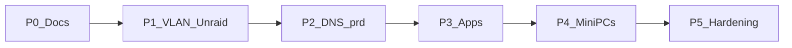

# Roadmap

Phased path from [inventory](inventory.md) → target. Principles and checklists only; leans live in [decisions](decisions.md).

## Principles

1. Keep media available while moving storage  
2. Free Gaming PC #1 after media/VMs leave  
3. GitOps early once a cluster exists  
4. Proxmox on Mac Mini is a bridge to bare-metal Talos  
5. Tailscale + homelab VLAN; HTTPS via `lab.jacobdrury.com`  
6. **`prd` first**; `stg` later if wanted  
7. **Agent-operable** — [agents](architecture/agents.md)  

## Phase 0 — Docs & inventory (now)

- [x] Architecture / decisions / this roadmap  
- [x] proto + moon in repo  
- [ ] Fill [inventory](inventory.md) specs + VM/LXC map  
- [ ] List everything still on Gaming PC #1  

**Exit:** PC #1 evacuation checklist known.

## Phase 1 — VLAN + Unraid + evacuate PC #1

Details: [networking](architecture/networking.md) · [storage](architecture/storage.md).

- [ ] Homelab VLAN in UniFi (UI OK; Tofu later)  
- [ ] Unraid **static IP** outside DHCP pool  
- [ ] Firewall: admin → lab; deny lab → sensitive VLANs by default  
- [ ] Tailscale on Mac Mini / always-on path  
- [ ] Buy Unraid license + USB; install on PC #2  
- [ ] SSD pool for `appdata` (small array disk only if Unraid requires one — **not** the 24TB)  
- [ ] Mount **24TB with Unassigned Devices** — do **not** format into the array  
- [ ] NFS/SMB export UD media; Jellyfin → Unraid; validate playback  
- [ ] iSCSI target plugin + SSD/pool LUNs (for later block PVCs)  
- [ ] Move/retire PC #1 guests; wipe PC #1 → gaming (24TB already in PC #2)  

**Exit:** Media on Unraid; PC #1 gaming-only; lab on VLAN.

### Phase 1b — Array / parity (when you can)

- [ ] Free space or second large disk → copy library off UD into array share  
- [ ] Optionally add old 24TB to array or as parity (**≥ largest data disk** for parity)  
- [ ] Wait for parity sync if enabled  

### Phase 1c — Backups

- [ ] Choose approach after Unraid is stable  
- [ ] Document a restore drill  

## Phase 2 — Cloudflare DNS + Talos `prd`

- [ ] Cloudflare DNS for `jacobdrury.com`; keep GitHub Pages  
- [ ] OpenTofu `infrastructure/dns/`  
- [ ] Later: registrar → Cloudflare  
- [ ] Talos VMs on Mac Mini (**prd only**)  
- [ ] `infrastructure/prd` + Argo → `clusters/prd`  
- [ ] Cilium, NFS CSI, **iSCSI CSI** (or initiator path), Tailscale operator, Envoy, cert-manager  
- [ ] 1Password Connect + ESO; seed once  
- [ ] LE for `*.lab.jacobdrury.com`  
- [ ] Later: optional `stg`  

**Exit:** `prd` GitOps-reachable on Tailscale + VLAN.

## Phase 3 — Migrate apps

1. Pi-hole  
2. *arr + qBittorrent (Mullvad peers; UI at `qbittorrent.lab.jacobdrury.com`)  
3. Jellyfin  
4. Homepage  
5. Home Assistant (after media; downtime OK)  

Each: `apps/` → Argo → `*.lab.jacobdrury.com` → retire old guest.

## Phase 4 — Bare-metal Talos

- [ ] Mini PCs; replace Mac Mini VMs  
- [ ] Mac Mini role: optional  

## Phase 5 — Hardening

- [ ] Prometheus, Grafana, Uptime Kuma → Discord  
- [ ] Agent workstation Tailscale + kubecontext docs / Cursor rules  
- [ ] Agent API tokens in 1Password  
- [ ] Optional MCP  
- [ ] Renovate when ready  
- [ ] UniFi Tofu catch-up if VLAN was UI-first  
- [ ] Restore / node-replace docs  
- [ ] Public HTTPS only if needed  
