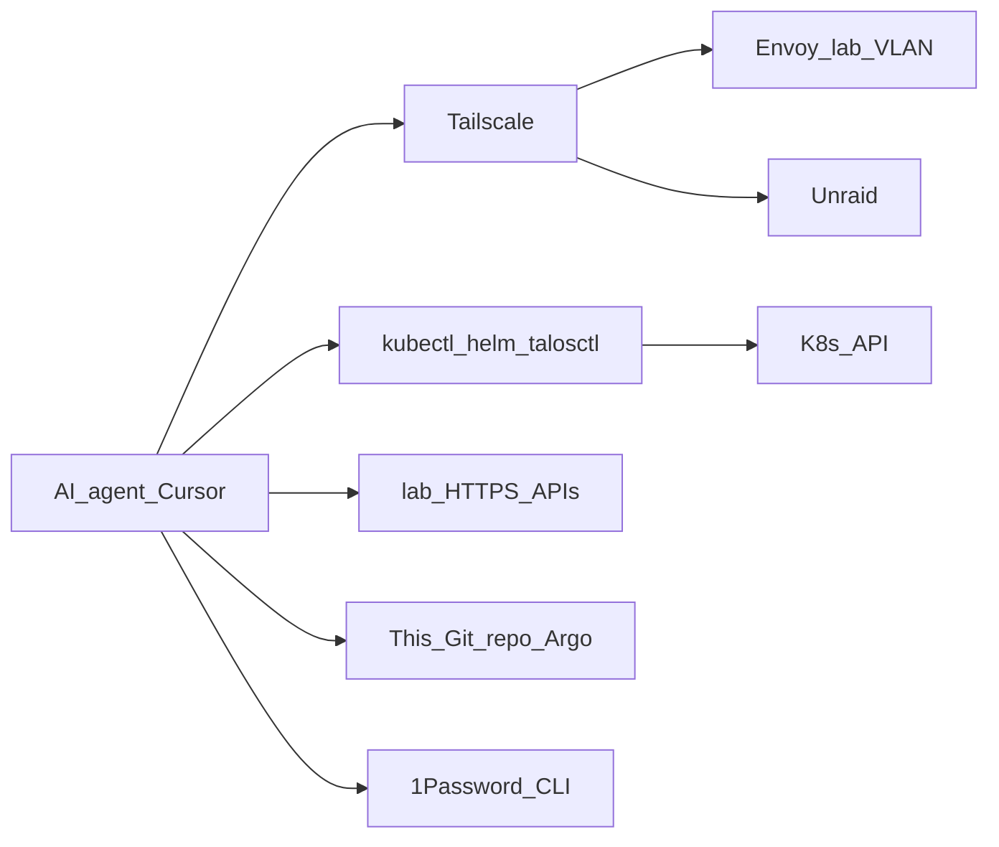
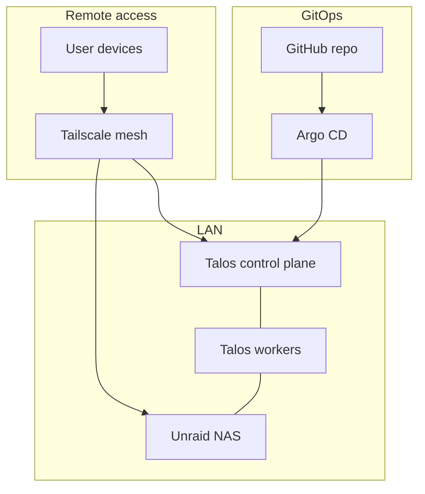
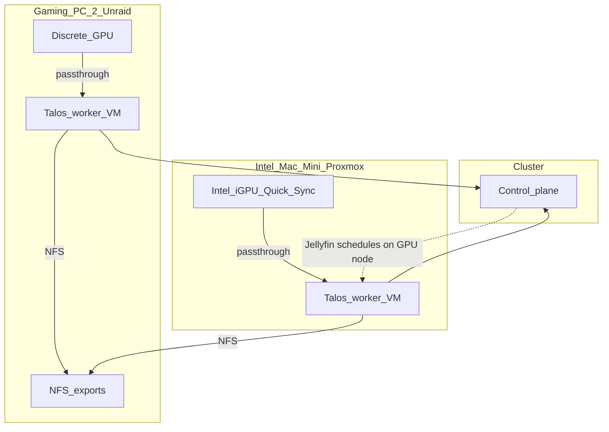
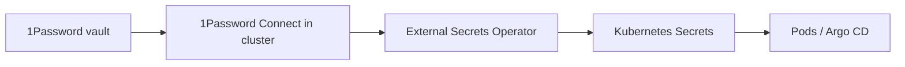
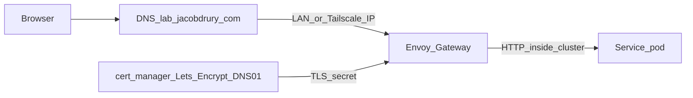

# Target architecture

Ideal end state. Bootstrap may use Proxmox VMs; production nodes are dedicated mini PCs running Talos.

## Design goals

- **Kubernetes everywhere** for app workloads (Talos Linux nodes)
- **GitOps** — GitHub is source of truth; Argo CD reconciles the cluster
- **Unraid NAS** owns all persistent storage (media, downloads, app config volumes)
- **Tailscale-only** remote access (no public ingress by default)
- **Declarative** machine + cluster config; minimize snowflake hosts
- **Return Gaming PC #1 to gaming** — no lab role once media and VMs are off it
- **Gaming PC #2 stays in the lab** — Unraid host; optional Talos **worker VM** with GPU passthrough for in-cluster Jellyfin
- **Agent-operable** — AI coding agents (e.g. Cursor) can observe and operate the lab as a first-class client, not a bolt-on

## Agent access (first-class)

Goal: from a Cursor (or similar) session you can **run commands against the lab** and **talk to services** (kubectl, logs, Unraid, HA, Argo, Grafana) without SSH hop folklore — with GitOps still the source of truth.



### How agents reach the lab

| Path | Role |
|------|------|
| **Tailscale on the agent host** | Primary. Same mesh as you: lab VLAN routes and/or Tailscale operator endpoints. Cloud-hosted agents need Tailscale on that runtime or a bridge (MCP/jump) — prefer local Cursor + Tailscale first |
| **kubeconfig / talosconfig** | Checked out or generated to a well-known local path; proto-pinned `kubectl` / `talosctl` / `helm` via moon |
| **HTTPS `*.lab.jacobdrury.com`** | Same URLs you use — Argo, Grafana, Homepage, HA REST, Unraid API |
| **1Password CLI (`op`)** | Secrets for agents: API tokens, kubeconfig fragments — **not** plaintext in Git |
| **MCP servers (optional)** | Kubernetes / HA / browser MCP so the agent can use structured tools, not only shell |

### Operating model (keep GitOps honest)

1. **Prefer Git** — agent edits this repo → PR → Argo syncs (matches how you want the lab managed).  
2. **Break-glass shell** — `kubectl` / `talosctl` / Unraid for diagnose, restart, one-off; avoid permanent snowflake applies.  
3. **Document for agents** — Cursor rules/skills in-repo: how to kubecontext, which hostnames, VLAN assumptions, “do not commit secrets.”  
4. **Least privilege later** — optional dedicated Tailscale identity + RBAC-limited ServiceAccount for agents vs your admin kubeconfig.

### Make it real in the buildout

| When | What |
|------|------|
| Phase 1–2 | Tailscale on your Mac (agent host) + Unraid + cluster; moon tools installed |
| Phase 2 | Stable `kubectl` access over Tailscale; Argo UI on `*.lab` |
| Phase 3+ | Service tokens in 1Password for HA / Unraid API; Homepage links agents can follow |
| Hardening | Agent RBAC, optional MCP, Cursor rule pack under `.cursor/` or skills |

**Non-goal:** exposing the kube API or Unraid to the public internet for agents. Agents join the **tailnet** (or run where the tailnet already is).

| Machine | Target role |
|---------|-------------|
| Gaming PC #1 | **Out of lab** — personal gaming PC |
| Gaming PC #2 | **Unraid NAS** (bare metal preferred); GPU reserved for lab if needed |
| Mac Mini | Interim Proxmox for Talos VMs; later optional / retire when mini PCs exist |
| Mini PCs (future) | Talos k8s nodes |
| Laptops | Optional experiments only |

## High-level topology



## Hardware target

| Layer | Role | Notes |
|-------|------|-------|
| Unraid on Gaming PC #2 | NAS (+ optional GPU) | NFS primary; 24TB+ disks; bare metal preferred over nested Unraid |
| Mini PCs (3+) | Talos k8s nodes | Prefer odd control-plane count (1 or 3). Workers scale as needed |
| Proxmox (interim) | VM host for Talos | **Mac Mini primarily**; do not depend on Gaming PC #1 |
| Laptops | Optional workers / lab | Not required for core path |

**Storage move:** 24TB leaves Gaming PC #1 → Unraid on Gaming PC #2 before PC #1 is wiped/returned to gaming.

### Unraid disk plan (initial → protected)

Unraid chosen over TrueNAS mainly for **mixed drive sizes** over time. Parity rule: **parity disk ≥ largest data disk**.

**Disks on hand today**

| Disk | Initial Unraid role | Notes |
|------|---------------------|-------|
| 24TB HDD | **Array data** (only data disk at first) | Holds `media/` (Jellyfin libraries) |
| NVMe / SATA SSD(s) on PC #2 | **Cache / pool** for `appdata` | Confirmed available — use for appdata / Docker / fast shares |
| USB flash | Unraid boot + license | Required |

**Out of scope for now:** any 2TB HDD (may stay in Gaming PC #1 for games — not part of the Unraid plan until decided).

**Phase A — stand up (no parity)**

1. Install Unraid bare metal on Gaming PC #2.
2. Assign **24TB as sole array data disk**; leave parity slots empty.
3. Put SSD/NVMe in a cache/pool; create shares: `media`, `downloads`, `appdata` (on SSD pool), `backups`.
4. Copy libraries from PC #1 → `media`; point Jellyfin at Unraid.

**Usable space initially:** ~24TB. **Protection:** none yet — same class of risk as a single disk today.

**Phase B — add parity later (easy, first-class Unraid flow)**

1. Buy a disk **≥ 24TB**.
2. Assign it as **Parity**.
3. Let Unraid build parity in the background (long on 24TB; array stays usable but slower).
4. After the build completes, single-disk failure of a data disk is recoverable.

Adding a second parity disk later is the same pattern. Extra data disks (8TB, 12TB, …) can be mixed sizes; only parity must stay ≥ the largest data disk.

**k8s storage:** still **NFS CSI → Unraid exports** (not iSCSI as primary; not Longhorn/Ceph).

### Unraid: VM vs bare metal

- **Can** run Unraid as a Proxmox VM (USB license + disk/HBA passthrough).
- **Should** run **bare metal on Gaming PC #2** for the steady state: simpler disks, clearer failure domain.
- Virtualize Unraid only if you need a short bridge; it is not the goal once PC #2 is dedicated.

### GPU for Jellyfin (in-cluster)

**Locked lean: pattern B** — keep Jellyfin in k8s; give the cluster a GPU by passing hardware into **one Talos worker** (not the whole cluster on the NAS).

Bare-metal Unraid owns PC #2’s discrete GPU. Other machines’ **Intel iGPUs** can also feed the cluster the same way (passthrough into a Talos worker, or bare-metal Talos later).

| Source | How it reaches k8s | Notes |
|--------|--------------------|-------|
| **PC #2 discrete GPU** | Unraid VM: GPU passthrough → Talos **worker** joins cluster | Pattern B; Unraid stays NAS; don’t put CP here |
| **Intel Mac Mini iGPU** | Proxmox: iGPU passthrough → Talos worker VM | **Yes — often ideal for Jellyfin** (Quick Sync / VA-API). Efficient; may be enough without a gaming GPU |
| **Laptop iGPUs / Quadro** | Same passthrough idea (Intel/AMD iGPU or **NVIDIA Quadro**) | **Technically yes**. Quadro → NVENC in Jellyfin is solid. Weak as 24/7 nodes unless docked, sleep disabled, reliable power. NVIDIA on Talos needs the NVIDIA device plugin + driver story (heavier than Intel i915) |



**Intel iGPU details (Mac Mini / many laptops)**

- Jellyfin loves **Quick Sync** — often better watts-per-transcode than a big gaming GPU for media.
- Needs: IOMMU/passthrough on Proxmox (or bare-metal Talos), Talos **i915** (and usually intel-ucode) system extensions, then Intel GPU device plugin (or `/dev/dri` mount) so the Jellyfin pod can use `/dev/dri/renderD128`.
- Full iGPU passthrough usually means **that one VM owns the iGPU** (host console/display gets awkward). Fine for a headless lab Mini.

**Laptops**

- Same GPU path if the silicon supports it (Intel QSV / AMD AMF / **NVIDIA Quadro NVENC**).
- Prefer them as **optional/burst workers**, not the only place Jellyfin lives, unless a laptop is dedicated docked 24/7 with sleep disabled.
- **Quadro laptop:** good encode capability; treat as a bonus GPU node after Mac Mini iGPU / PC #2, not the primary plan — NVIDIA + Talos is more setup than Intel Quick Sync.

**Practical order**

1. Try **Mac Mini iGPU → Talos worker** for Jellyfin first (power-efficient, already in the lab).
2. Add **PC #2 discrete GPU → Talos worker VM on Unraid** if you need more concurrent transcodes or the Mini’s iGPU isn’t enough.
3. **Quadro laptop** only if it’s parked 24/7 — useful NVENC capacity, more driver complexity on Talos.
4. Other laptop iGPUs only if convenient — don’t block the design on them.

**Avoid:** running the full Talos control plane on Unraid only for a GPU.
## Kubernetes platform

| Piece | Choice | Why |
|-------|--------|-----|
| OS | Talos Linux | Immutable, API-driven, purpose-built for k8s |
| Bootstrap | `talosctl` + machine configs in Git | Same GitOps mindset as apps |
| CNI | Cilium | Network policies, Hubble optional; solid Talos pairing |
| GitOps | Argo CD | App-of-apps or ApplicationSets from this repo |
| Secrets | **1Password** + Connect + External Secrets Operator | Vault in 1Password; Git only has `ExternalSecret` refs |
| Storage | NFS CSI → Unraid exports | Unraid is the storage plane; cluster does not run Longhorn/Ceph as primary |
| Ingress (internal) | **Envoy Gateway** (Gateway API) | HTTPRoutes; Envoy dataplane (matches work familiarity) |
| Mesh access | **Tailscale Kubernetes operator** (+ Unraid on tailnet) | Subnet router only if whole-LAN access needed |

### Suggested node layout (steady state)

- **3 control-plane** mini PCs (HA) — or **1 CP** while learning, then expand
- **N workers** for media + apps (can co-locate workloads on CP early if small)

Interim on Proxmox: same topology as VMs (e.g. 1 CP + 2 workers) with configs that later move to bare metal with minimal change.

## Unraid responsibilities

Unraid is **out of cluster** and owns disks.

| Export / share | Used for |
|----------------|----------|
| `media/` | Jellyfin libraries |
| `downloads/` | qBittorrent incomplete/complete |
| `apps/` | App config (Sonarr, Prowlarr, etc.) via NFS PVCs or bind-style mounts |
| `backups/` | Velero / app DB dumps / Unraid native backups |

Cluster mounts these via **NFS CSI** (ReadWriteMany where needed for media).

## Secrets (1Password)

Works well with this stack — you already pay for it, UI is familiar, and it fits GitOps.



| Piece | Role |
|-------|------|
| 1Password vault(s) | Source of truth (e.g. `Homelab`) — API tokens, DB passwords, Tailscale auth keys |
| 1Password Connect | In-cluster API that caches vault items for ESO |
| External Secrets Operator | Turns `ExternalSecret` CRs into normal `Secret` objects |
| Git | Only references (`item` / field names) — **no secret values** |

**Bootstrap caveat:** Connect needs a one-time credentials seed in the cluster (Connect token + credentials file) before ESO can sync anything. That seed is applied once via `kubectl` (or a small bootstrap script), not committed in plaintext. After that, Argo CD manages Connect/ESO and all app secrets from Git refs.

SOPS is **not** required if 1Password is the vault; keep SOPS off the critical path unless you later want encrypted bootstrap files in Git.

## DNS, TLS, and Tailscale

**Base zone:** `lab.jacobdrury.com` under owned `jacobdrury.com`.

**Registrar / DNS:** Squarespace today. Move **DNS to Cloudflare first** (required for LE + OpenTofu). **Transfer the domain into Cloudflare Registrar later** so everything is one account — optional for TLS, desired for simplicity.

**Preserve on DNS cutover:** apex GitHub Pages for `jacobdrury.com` (recreate the same GitHub Pages A/`www` CNAME records in Cloudflare; prefer DNS-only / grey-cloud for those). Lab records (`*.lab`, ACME TXT) live alongside without touching the marketing site.

**Domain ownership path**

1. **Soon:** Point Squarespace nameservers → Cloudflare; IaC DNS with OpenTofu (keep GitHub Pages).  
2. **Later:** **Transfer registration** of `jacobdrury.com` into Cloudflare Registrar so registrar + DNS are one account.  

No rush on the transfer for lab TLS — DNS move is what unblocks cert-manager. Transfer is the “one place” end state.

**IaC for Cloudflare DNS**

| Layer | Tool | Owns |
|-------|------|------|
| Static / rare records | **OpenTofu** via proto (`moon run` tasks later) in `infrastructure/dns/` | Apex GitHub Pages, `www`, zone settings |
| App hostnames (optional later) | **external-dns** in each cluster | `HTTPRoute`/Service → A/AAAA/CNAME for `*.lab` / `*.stg.lab` as apps appear |
| ACME TXT | **cert-manager** Cloudflare solver | `_acme-challenge.*` (ephemeral; don’t manage those in Terraform) |

Cloudflare API token stays in **1Password**; Tofu runs from your machine or CI with that secret. No need to click DNS in the Cloudflare UI long-term.

**Access model:** no public inbound ports for apps. Reachability is **LAN (homelab VLAN) and/or Tailscale**. HTTPS still applies — “Tailscale-only” is about who can connect from the internet, not about skipping TLS.

### UniFi network (homelab VLAN)

You already run **UniFi**. Plan a dedicated **homelab VLAN**, isolated from trusted LAN / IoT / etc., with **selective allow rules** for crossover (e.g. admin clients → lab, lab → DNS if needed, block lab → IoT by default).

**Unraid IP (recommend):**

| Approach | Verdict |
|----------|---------|
| **Static on Unraid** at a low address **outside** the VLAN DHCP pool (e.g. `10.x.y.10`) | **Preferred for NAS** — still boots with a known IP if the controller is down; NFS/CSI clients need stability |
| UniFi “fixed IP” / DHCP reservation only | Fine for clients; weaker if DHCP/controller is unavailable at Unraid boot |
| Both | Optional: static on Unraid **and** a UniFi client reservation for the same IP (inventory + UI niceness) |

Pick a dedicated subnet (example only — choose what fits your UniFi scheme), e.g. `10.40.0.0/24`, DHCP `.100–.199`, Unraid `.10`, future LB/VIP `.20`, Mac Mini / nodes `.11+`.

**IaC for UniFi:** **yes, with caveats.** Community OpenTofu/Terraform providers can manage networks/VLANs and firewall policy (legacy `firewall_rule` vs newer zone-based `firewall_policy` depending on UniFi Network version). Lean:

- Put UniFi under `infrastructure/unifi/` (OpenTofu), API key in 1Password  
- Start with: homelab VLAN/network + DHCP range + a few allow/deny policies  
- Expect provider churn on UniFi OS 9/10 zone firewall — pin provider version; don’t IaC every Wi‑Fi tweak on day one  

Cloudflare DNS + UniFi can both be Tofu; keep them as separate roots (`infrastructure/dns`, `infrastructure/unifi`).

### Environment → domain

Repo layout keeps `stg` + `prd` paths for future flexibility. **Bootstrap lean: `prd` only.**

Solo lab, nothing critical, one consumer → a second cluster is mostly double Argo/Talos/certs/ops. Virtual `stg` on the Mac Mini is easy *later*; starting with only `prd` is less to maintain.

| Env | When | Hostnames |
|-----|------|-----------|
| **prd** | **Now** (Mac Mini VMs → mini PCs) | `*.lab.jacobdrury.com` |
| **stg** | **Later** if you want a scratch cluster | `*.stg.lab.jacobdrury.com` |

Don’t delete `clusters/stg` from the mental model — just don’t stand it up until you feel the pain of testing on `prd`.

When `stg` exists: separate Argo root, overlays for hostnames, optional 1Password prefixes, Talos under `infrastructure/stg/`.

### How HTTPS works



| Piece | Choice |
|-------|--------|
| Prd names | `*.lab.jacobdrury.com` (no `prd` label) |
| Stg names | `*.stg.lab.jacobdrury.com` |
| Edge | Envoy Gateway terminates TLS per cluster |
| Certificates | **cert-manager + Let’s Encrypt DNS-01** via **Cloudflare** (domain stays registered at Squarespace) |
| Why DNS-01 | Services stay private; browsers still trust the certs; Squarespace DNS cannot automate ACME |
| Secrets | Cloudflare API token in **1Password** → External Secrets → cert-manager |

Use the hostname for that env, not a raw IP.

### Local network (at home)

**Yes — HTTPS on the LAN** if Pi-hole (or UniFi DNS) in/resolving for the homelab VLAN points `*.lab.jacobdrury.com` at Envoy’s lab IP, e.g. `https://jellyfin.lab.jacobdrury.com`.

### Remote (Tailscale)

**Same per-env HTTPS URLs.** Tailnet DNS points `*.lab.jacobdrury.com` / `*.stg.lab.jacobdrury.com` at each cluster’s Envoy over Tailscale.

### Simple vs split-horizon DNS

| Approach | Behavior |
|----------|----------|
| **Always Tailscale** (simplest) | Even at home, resolve names to Tailscale IPs |
| **Split-horizon** | At home → LAN IP; remote → Tailscale IP |

**Lean:** start **always Tailscale**; add split-horizon later if needed.

### Tailscale: operator vs subnet router

| Approach | Best for |
|----------|----------|
| **Tailscale Kubernetes operator** | kube API, Envoy/HTTPRoutes on the tailnet, GitOps-friendly — **primary lean** |
| **Tailscale on Unraid** (normal node) | Admin UI + NFS host on the same tailnet |
| **Subnet router** | Reaching arbitrary LAN IPs that are *not* on Tailscale |

**Recommend:** operator on each cluster (`stg` / `prd`) + Tailscale client on Unraid (and Mac Mini while it’s a Proxmox host). Add a subnet router only if you need whole-LAN access without installing Tailscale on every device.

Free Tailscale Personal is enough for this lab; upgrade only if you hit device/ACL limits.

### What you will not have (by default)

- Public internet access to lab hostnames  
- Valid HTTPS on bare IPs  
- `stg` and `prd` sharing one hostname  

### Adding public HTTPS later

Cloudflare Tunnel or Tailscale Funnel on selected routes; keep private apps Tailscale-only.

## App placement (target)

| Workload | Target home | Notes |
|----------|-------------|-------|
| Jellyfin | k8s | NFS `media/`; schedule on a **GPU worker** (prefer Mac Mini iGPU passthrough; else PC #2 dGPU → Talos VM on Unraid). See [GPU section](#gpu-for-jellyfin-in-cluster) |
| Sonarr ×2, Prowlarr, qBittorrent | k8s | *arr stack; downloads on Unraid NFS |
| Pi-hole / DNS | k8s (keep **Pi-hole**) | Stick with Pi-hole; no need to switch to AdGuard |
| Home Assistant | k8s **or** VM/LXC | **In-cluster after Jellyfin/*arr**; downtime OK; USB passthrough only if a radio requires it |
| Argo CD | k8s (system) | Bootstrapped once, then manages everything else |
| Monitoring | k8s | **Prometheus + Grafana + Uptime Kuma**; alerts to **Discord** |
| Homepage | k8s | [gethomepage.dev](https://gethomepage.dev) dashboard over `*.lab` / `*.stg.lab` |

## GitOps repo shape (proposed)

Multi-cluster from day one: shared app definitions under `apps/`, per-cluster roots under `clusters/`. Developer toolchain via [moonrepo](https://moonrepo.dev/) (proto + moon).

```text
homelab/
  .prototools                # proto-pinned CLIs (moon, tofu, kubectl, helm, …)
  .moon/                     # moon workspace + toolchains
  moon.yml                   # root tasks (tools-install, check, …)
  docs/                      # architecture & inventory (this)
  infrastructure/
    stg/                     # Talos machine configs for stg
    prd/                     # Talos machine configs for prd
    dns/                     # OpenTofu Cloudflare DNS (soon)
    unifi/                   # OpenTofu UniFi VLAN / firewall (soon)
  bootstrap/                 # how to install Argo CD on a new cluster
  apps/
    system/                  # cilium, nfs-csi, cert-manager, tailscale
                             # 1password-connect, external-secrets, envoy-gateway
    media/                   # jellyfin, *arr, qbittorrent
    home/                    # homeassistant (if in-cluster), homepage
    network/                 # pihole
  clusters/
    stg/                     # Argo app-of-apps (or ApplicationSet) for stg
    prd/                     # same pattern for prd
```

| Path | Role |
|------|------|
| `.prototools` / moon | Pinned CLIs + runnable tasks |
| `apps/*` | Shared desired state (Helm/Kustomize bases). Prefer overlays or helm values per cluster rather than duplicating whole apps |
| `clusters/stg` | Stg Argo root — apps + **stg hostnames** (`*.stg.lab.jacobdrury.com`) |
| `clusters/prd` | Prd Argo root — apps + **bare lab hostnames** (`*.lab.jacobdrury.com`) |
| `infrastructure/<cluster>` | Talos configs / cluster-specific bootstrap notes |
| `infrastructure/dns` | OpenTofu for Cloudflare zone (GitHub Pages + lab records) |
| `infrastructure/unifi` | OpenTofu for homelab VLAN / DHCP / firewall allows (UniFi) |

**How Argo sees it:** each cluster runs its own Argo CD (or one management cluster later). That Argo’s root Application points at `clusters/<name>/` only — so `stg` never auto-applies `prd`’s root.

**Contract:** merge to `main` → each cluster’s Argo reconciles **its** `clusters/<name>/` tree. `stg` is for trying charts/values; promote to `prd` by updating `clusters/prd` (and shared `apps/` when safe).

Early on: stand up **`prd` only** (Talos VMs on Mac Mini → mini PCs). Keep `stg` paths in the repo for later; don’t run a second cluster until you want one.
## Explicit non-goals (for now)

- Public internet exposure of the media stack
- Ceph/Longhorn as primary storage (Unraid is primary)
- Running Unraid as the only hypervisor long-term (mini PCs + Talos)
- Hosting the full Talos control plane on Unraid solely to expose the GPU
- Keeping Gaming PC #1 as a permanent Proxmox / storage host
